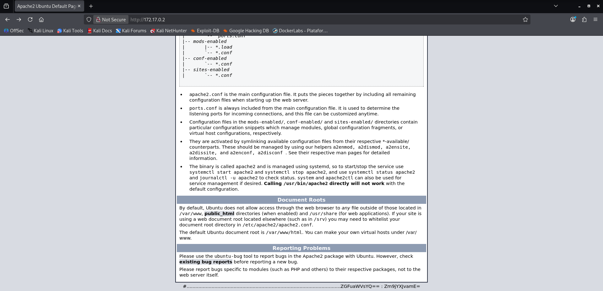

# Extraviado — DockerLabs Writeup

**Platform:** DockerLabs | **Difficulty:** Easy | **Target IP:** 172.17.0.2 | 

## Descripcion 

Codificación en base64, acceso por SSH y escalada de privilegios mediante directorios ocultos y practicando criptografía.

## Attack chain: 

**Nmap → Web Enumeration → Credential Disclosure → Base64 Decoding → SSH Access → Hidden Directory Enumeration → User Pivot → Hidden File Enumeration → Password Discovery → Privilege Escalation → Root**


### 1. Escaneo de servicios y puertos abiertos.

```text
┌──(mariano㉿Kaotic)-[~/Downloads/dockerlabs-machines/02-faciles/extraviado]
└─$ sudo nmap -sC -sV 172.17.0.2     
[sudo] password for mariano: 
Starting Nmap 7.99 ( https://nmap.org ) at 2026-10-08 11:54 -0300
Nmap scan report for 172.17.0.2
Host is up (0.0000070s latency).
Not shown: 998 closed tcp ports (reset)
PORT   STATE SERVICE VERSION
22/tcp open  ssh     OpenSSH 9.6p1 Ubuntu 3ubuntu13.5 (Ubuntu Linux; protocol 2.0)
| ssh-hostkey: 
|   256 cc:d2:9b:60:14:16:27:b3:b9:f8:79:10:df:a1:f3:24 (ECDSA)
|_  256 37:a2:b2:b2:26:f2:07:d1:83:7a:ff:98:8d:91:77:37 (ED25519)
80/tcp open  http    Apache httpd 2.4.58 ((Ubuntu))
|_http-server-header: Apache/2.4.58 (Ubuntu)
|_http-title: Apache2 Ubuntu Default Page: It works
MAC Address: F2:CA:6E:05:79:E2 (Unknown)
Service Info: OS: Linux; CPE: cpe:/o:linux:linux_kernel

Service detection performed. Please report any incorrect results at https://nmap.org/submit/ .
Nmap done: 1 IP address (1 host up) scanned in 7.12 seconds

```
Ingresamos a la ip ya que tenemos un servidor apache, asi como tambien SSH cada uno con sus respectivos puertos.

## 2. Decodificacion de credenciales y conexion SSH.

Ingresamos a la IP, vemos que se encuentra por defecto salvo por el footer el cual tiene lo siguiente



Si hacemos un curl podemos visualizar que se encuentra exactamente lo mismo que vimos por la pagina, adjunto las ultimas lineas por cuestiones practicas 

```text
┌──(mariano㉿Kaotic)-[~/Downloads/dockerlabs-machines/02-faciles/extraviado]
└─$ curl 172.17.0.2

    <div class="validator">
    </div>
  </body>
</html>

#.........................................................................................................ZGFuaWVsYQ== : Zm9jYXJvamE=

```

Se decodifica ya que se encuentra en base 64.

```text
                                                                                                                                                     
┌──(mariano㉿Kaotic)-[~/Downloads/dockerlabs-machines/02-faciles/extraviado]
└─$ echo "ZGFuaWVsYQ==" | base64 -d                                                
daniela                                                                                                                                                     
┌──(mariano㉿Kaotic)-[~/Downloads/dockerlabs-machines/02-faciles/extraviado]
└─$ echo "Zm9jYXJvamE=" | base64 -d
focaroja    

```

Obtenemos credenciales para la conexion al servidor SSH, precedmos a la conexion e intento de escalada de privilegios.

3. SSH, escalada de privilegios.

Realizamos la conexion e intentamos escalar privilegios mediante SUDOERS o SUID. 

 ```
┌──(mariano㉿Kaotic)-[~/Downloads/dockerlabs-machines/02-faciles/extraviado]
└─$ ssh daniela@172.17.0.2
The authenticity of host '172.17.0.2 (172.17.0.2)' can't be established.
ED25519 key fingerprint is: SHA256:+m+3lOrvpuNRPzkV7ZobI+TK6be0QFiuxBsmiIvgj+E
This key is not known by any other names.
Are you sure you want to continue connecting (yes/no/[fingerprint])? yes
Warning: Permanently added '172.17.0.2' (ED25519) to the list of known hosts.
daniela@172.17.0.2's password: 
Welcome to Ubuntu 24.04.1 LTS (GNU/Linux 7.1.5+kali-amd64 x86_64)

 * Documentation:  https://help.ubuntu.com
 * Management:     https://landscape.canonical.com
 * Support:        https://ubuntu.com/pro

This system has been minimized by removing packages and content that are
not required on a system that users do not log into.

To restore this content, you can run the 'unminimize' command.

The programs included with the Ubuntu system are free software;
the exact distribution terms for each program are described in the
individual files in /usr/share/doc/*/copyright.

Ubuntu comes with ABSOLUTELY NO WARRANTY, to the extent permitted by
applicable law.

daniela@dockerlabs:~$ whoami
daniela
daniela@dockerlabs:~$ id
uid=1002(daniela) gid=1002(daniela) groups=1002(daniela),100(users)
daniela@dockerlabs:~$ sudo -l
-bash: sudo: command not found
daniela@dockerlabs:~$ find / -perm -4000 2>/dev/null
/usr/bin/umount
/usr/bin/mount
/usr/bin/chsh
/usr/bin/newgrp
/usr/bin/su
/usr/bin/passwd
/usr/bin/gpasswd
/usr/bin/chfn
/usr/lib/openssh/ssh-keysign
/usr/lib/dbus-1.0/dbus-daemon-launch-helper

```
No tenemos permisos para `sudo -l` y con `SUID` no encontramos ninguno explotable, exploramos la maquina para obtener mas informacion.

```
daniela@dockerlabs:~$ ls -la
total 40
drwxr-x--- 1 daniela daniela 4096 Oct  8 09:18 .
drwxr-xr-x 1 root    root    4096 Jan  9  2025 ..
-rw-r--r-- 1 daniela daniela  220 Jan  9  2025 .bash_logout
-rw-r--r-- 1 daniela daniela 3771 Jan  9  2025 .bashrc
drwx------ 2 daniela daniela 4096 Oct  8 09:18 .cache
drwxrwxr-x 3 daniela daniela 4096 Jan  9  2025 .local
-rw-r--r-- 1 daniela daniela  807 Jan  9  2025 .profile
drwxrwxr-x 2 daniela daniela 4096 Jan  9  2025 .secreto
drwxrwxr-x 2 daniela daniela 4096 Jan  9  2025 Desktop
daniela@dockerlabs:~$ cd .secreto
daniela@dockerlabs:~/.secreto$ ls -la
total 12
drwxrwxr-x 2 daniela daniela 4096 Jan  9  2025 .
drwxr-x--- 1 daniela daniela 4096 Oct  8 09:18 ..
-rw-rw-r-- 1 daniela daniela   17 Jan  9  2025 passdiego
daniela@dockerlabs:~/.secreto$ cat passdiego
YmFsbGVuYW5lZ3Jh
daniela@dockerlabs:~/.secreto$ echo "YmFsbGVuYW5lZ3Jh" | base64 -d
ballenanegra
daniela@dockerlabs:~/.secreto$ 

```
Dentro del directorio oculto `.secreto` logramos obtener la clave del usuario `diego`, pasamos a dicho usuario e intetamos escalar privilegios nuevamente, el cual no es posible.

```
daniela@dockerlabs:~/.secreto$ su diego
Password: 
diego@dockerlabs:/home/daniela/.secreto$ sudo -l
bash: sudo: command not found
diego@dockerlabs:/home/daniela/.secreto$ find / -perm 4000 2>/dev/null
diego@dockerlabs:/home/daniela/.secreto$ 

```
Exploramos nuevamente 

```
diego@dockerlabs:/home/daniela/.secreto$ ls -la
total 12
drwxrwxr-x 2 daniela daniela 4096 Jan  9  2025 .
drwxr-x--- 1 daniela daniela 4096 Oct  8 13:48 ..
-rw-rw-r-- 1 daniela daniela   17 Jan  9  2025 passdiego
diego@dockerlabs:/home/daniela/.secreto$ cd 
diego@dockerlabs:~$ ls -la
total 48
drwxr-x--- 1 diego diego 4096 Oct  8 13:48 .
drwxr-xr-x 1 root  root  4096 Jan  9  2025 ..
-rw------- 1 diego diego 1366 Oct  8 13:48 .bash_history
-rw-r--r-- 1 diego diego  233 Jan  9  2025 .bash_logout
-rw-r--r-- 1 diego diego 3771 Jan  9  2025 .bashrc
drwxrwxr-x 1 diego diego 4096 Jan  9  2025 .local
drwxrwxr-x 1 diego diego 4096 Jan 11  2025 .passroot
-rw-r--r-- 1 diego diego  807 Jan  9  2025 .profile
-rw-rw-r-- 1 diego diego   15 Jan  9  2025 pass
diego@dockerlabs:~$ cat pass
donde estara?

diego@dockerlabs:~$ cd .passroot
diego@dockerlabs:~/.passroot$ ls -la
total 16
drwxrwxr-x 1 diego diego 4096 Jan 11  2025 .
drwxr-x--- 1 diego diego 4096 Oct  8 13:48 ..
-rw-rw-r-- 1 diego diego   21 Jan 11  2025 .pass
diego@dockerlabs:~/.passroot$ cat .pass
YWNhdGFtcG9jb2VzdGE=
```

Encontramos una posible clave, la decodificamos pero no es la correcta 

```
┌──(mariano㉿Kaotic)-[~/Downloads/dockerlabs-machines/02-faciles/extraviado]
└─$ echo "YWNhdGFtcG9jb2VzdGE=" | base64 -d
acatampocoesta            

```
Continuamos buscando dentro los directorios ocultos, y vamos al que nos queda pendiente `.local`, el cual dentro de los subdirectorios vemos el archivo con el nombre `.-`

```
diego@dockerlabs:~$ ls -la
total 48
drwxr-x--- 1 diego diego 4096 Oct  8 13:48 .
drwxr-xr-x 1 root  root  4096 Jan  9  2025 ..
-rw------- 1 diego diego 1366 Oct  8 13:48 .bash_history
-rw-r--r-- 1 diego diego  233 Jan  9  2025 .bash_logout
-rw-r--r-- 1 diego diego 3771 Jan  9  2025 .bashrc
drwxrwxr-x 1 diego diego 4096 Jan  9  2025 .local
drwxrwxr-x 1 diego diego 4096 Jan 11  2025 .passroot
-rw-r--r-- 1 diego diego  807 Jan  9  2025 .profile
-rw-rw-r-- 1 diego diego   15 Jan  9  2025 pass
diego@dockerlabs:~$ cd .local
diego@dockerlabs:~/.local$ ls -la
total 20
drwxrwxr-x 1 diego diego 4096 Jan  9  2025 .
drwxr-x--- 1 diego diego 4096 Oct  8 13:48 ..
drwx------ 1 diego diego 4096 Oct  8 13:07 share
diego@dockerlabs:~/.local$ cd share
diego@dockerlabs:~/.local/share$ ls -la
total 24
drwx------ 1 diego diego 4096 Oct  8 13:07 .
-rw-r--r-- 1 root  root   319 Jan 11  2025 .-
drwxrwxr-x 1 diego diego 4096 Jan  9  2025 ..
drwx------ 2 diego diego 4096 Jan  9  2025 nano
diego@dockerlabs:~/.local/share$ cat .-

password de root

En un mundo de hielo, me muevo sin prisa,
con un pelaje que brilla, como la brisa.
No soy un rey, pero en cuentos soy fiel,
de un color inusual, como el cielo y el mar
tambien.
Soy amigo de los ni~nos, en historias de
ensue~no.
Quien soy, que en el frio encuentro mi due~no?
diego@dockerlabs:~/.local/share$ 

```

Resolvemos el acertijo, de acuerdo a la pista siendo esta la respuesta `osoazul` y escalamos al usuario root.

```
diego@dockerlabs:~/.local/share$ su root
Password: 
root@dockerlabs:/home/diego/.local/share# whoami
root
root@dockerlabs:/home/diego/.local/share# id
uid=0(root) gid=0(root) groups=0(root)
root@dockerlabs:/home/diego/.local/share# 

```


# Conclusión

A partir del escaneo inicial con **Nmap** fue posible identificar los servicios expuestos en la máquina, encontrando un servidor **SSH** en el puerto `22` y un servidor **Apache** en el puerto `80`.

Posteriormente, se realizó una revisión del servidor web. Aunque Apache mostraba su página por defecto, al inspeccionar directamente el contenido mediante `curl` fue posible encontrar información adicional expuesta en el código HTML. Esta información se encontraba codificada mediante **Base64**, permitiendo recuperar unas credenciales válidas para el usuario `daniela`.

Con las credenciales obtenidas se estableció una conexión mediante **SSH**, consiguiendo acceso inicial al sistema como un usuario sin privilegios administrativos. Se realizaron comprobaciones de `sudo` y de archivos con permisos **SUID**, pero no se encontró inicialmente una vía directa de escalada de privilegios.

La enumeración local permitió descubrir diferentes **directorios y archivos ocultos** dentro del sistema. En el directorio `.secreto` del usuario `daniela` se encontró el archivo `passdiego`, cuyo contenido estaba nuevamente codificado en Base64. Después de decodificarlo se obtuvo la contraseña del usuario `diego`, permitiendo realizar un cambio de usuario mediante `su`.

Una vez como `diego`, se continuó con la enumeración de los archivos ocultos de su directorio personal. Dentro de `.passroot` se encontró una posible contraseña, aunque después de decodificarla se comprobó que no era válida. Esto llevó a continuar la búsqueda dentro del directorio `.local`.

Finalmente, dentro de `.local/share` se encontró un archivo oculto llamado `.-`, cuyo contenido indicaba que allí se encontraba la contraseña de `root`, pero en forma de un **acertijo**. La resolución del acertijo permitió obtener la contraseña `osoazul`.

Utilizando esta contraseña fue posible realizar un cambio al usuario **root** mediante `su` y confirmar la escalada de privilegios mediante `whoami` e `id`, obteniendo así control completo sobre la máquina.


| Vulnerabilidad / Mala configuración                          | Impacto                                                                                                                                                         | Mitigación                                                                                                                                                                                      |
| ------------------------------------------------------------ | --------------------------------------------------------------------------------------------------------------------------------------------------------------- | ----------------------------------------------------------------------------------------------------------------------------------------------------------------------------------------------- |
| **Información sensible expuesta mediante el servidor web**   | El contenido accesible desde Apache contenía información que permitió obtener las credenciales iniciales del sistema.                                           | Revisar periódicamente el contenido publicado por el servidor web y evitar almacenar información sensible en recursos accesibles públicamente.                                                  |
| **Credenciales expuestas mediante Base64**                   | Las credenciales de `daniela` estaban disponibles directamente en el contenido web y únicamente ofuscadas mediante Base64, permitiendo recuperarlas fácilmente. | Nunca utilizar Base64 como mecanismo de protección de credenciales. Utilizar mecanismos seguros de gestión de secretos y restringir el acceso a información sensible.                           |
| **Credenciales reutilizables para acceso SSH**               | Las credenciales descubiertas permitieron obtener acceso remoto al sistema mediante SSH como un usuario legítimo.                                               | Utilizar contraseñas robustas y únicas. Implementar autenticación mediante claves SSH cuando sea apropiado y restringir el acceso SSH a los usuarios que realmente lo necesiten.                |
| **Credenciales almacenadas en directorios ocultos**          | El archivo `.secreto/passdiego` contenía una contraseña que permitió cambiar del usuario `daniela` al usuario `diego`.                                          | No almacenar contraseñas en texto plano ni en archivos accesibles desde cuentas de usuario. Utilizar mecanismos seguros de gestión de credenciales y aplicar permisos restrictivos.             |
| **Credenciales nuevamente codificadas mediante Base64**      | La contraseña de `diego` podía recuperarse fácilmente debido a que Base64 no proporciona confidencialidad.                                                      | No utilizar codificación como mecanismo de seguridad. Las contraseñas deben almacenarse mediante funciones de hash adecuadas y las credenciales deben gestionarse de forma segura.              |
| **Archivos y directorios ocultos accesibles**                | La enumeración de archivos ocultos permitió descubrir información sensible y credenciales adicionales dentro de los directorios personales.                     | Aplicar correctamente los permisos de archivos y directorios. No considerar un archivo como seguro simplemente por comenzar con `.`.                                                            |
| **Información sensible almacenada en archivos legibles**     | La exploración de `.local/share/.-` permitió descubrir información que finalmente condujo a la contraseña de `root`.                                            | Evitar almacenar contraseñas o pistas que permitan recuperarlas dentro del sistema. Restringir mediante permisos el acceso a información sensible.                                              |
| **Contraseña de root recuperable mediante un archivo local** | La información encontrada permitió obtener directamente las credenciales del usuario `root` y realizar una escalada completa de privilegios.                    | No almacenar credenciales de `root` ni información que permita recuperarlas en archivos accesibles por usuarios sin privilegios. Utilizar controles de acceso estrictos y autenticación segura. |
| **Uso de `su` para acceder a root mediante contraseña**      | Al conocer la contraseña de `root`, fue posible cambiar directamente al usuario privilegiado y obtener control completo del sistema.                            | Restringir el uso de `su`, aplicar políticas de autenticación adecuadas y utilizar mecanismos de administración con mínimo privilegio.                                                          |
| **Ausencia de una correcta separación de privilegios**       | Un usuario inicialmente sin privilegios pudo encadenar diferentes descubrimientos de credenciales hasta alcanzar `root`.                                        | Aplicar el principio de mínimo privilegio, separar adecuadamente las cuentas y limitar el acceso entre usuarios y recursos del sistema.                                                         |

## Recomendaciones generales

* Evitar exponer **credenciales o información sensible** mediante servidores web.
* No utilizar **Base64 como mecanismo de protección** de contraseñas o secretos.
* Utilizar contraseñas **robustas y únicas** para cada usuario y servicio.
* Evitar almacenar contraseñas en archivos dentro de los directorios personales.
* Aplicar correctamente los **permisos de archivos y directorios**, especialmente sobre información sensible.
* No asumir que los archivos ocultos son seguros simplemente por comenzar con `.`.
* Restringir el acceso a las cuentas privilegiadas y aplicar el **principio de mínimo privilegio**.
* Proteger especialmente las credenciales del usuario **root** y evitar almacenarlas en texto plano o en ubicaciones accesibles por usuarios comunes.
* Revisar periódicamente los permisos de los archivos y directorios del sistema.
* Limitar el acceso mediante **SSH** únicamente a los usuarios que realmente necesiten utilizarlo.
* Considerar mecanismos de autenticación más seguros, como **claves SSH**, en lugar de depender exclusivamente de contraseñas.
* Realizar auditorías periódicas de la configuración del sistema para identificar posibles rutas de escalada de privilegios.

